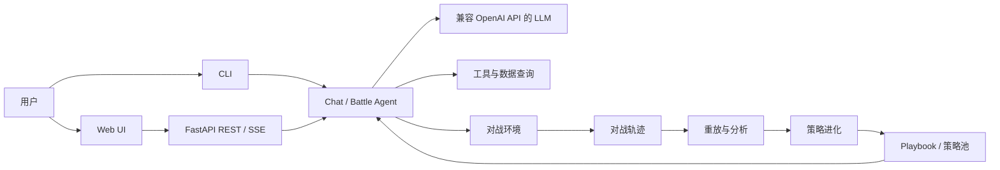

# Rock PVP Agent

<!--
正式发布前请替换 OWNER/REPOSITORY，并根据实际 CI、许可证和发布渠道启用徽章。

[](https://github.com/OWNER/REPOSITORY/actions/workflows/tests.yml)
[](https://www.python.org/)
[](#开源协议)
-->

Rock PVP Agent 是一个围绕精灵组队、回合制对战与 LLM 策略进化构建的实验性 Agent 项目。项目包含可独立运行的对战引擎、Chat Agent、Web 界面、队伍构建、人类与 Agent 对战、Agent 自博弈、轨迹重放，以及带评测门禁和版本回滚的策略进化管线。

> [!IMPORTANT]
> 本项目目前处于研究与开发阶段。自进化、价值评估和长期记忆等功能应视为实验能力；任何“策略提升”结论都需要在真实模型、独立数据集和完整评测上下文下复验。

## 目录

- [项目简介](#项目简介)
- [核心功能](#核心功能)
- [系统架构](#系统架构)
- [快速开始](#快速开始)
- [使用方法](#使用方法)
- [配置说明](#配置说明)
- [数据与输出](#数据与输出)
- [项目结构](#项目结构)
- [开发与测试](#开发与测试)
- [版本信息](#版本信息)
- [未来规划](#未来规划)
- [贡献指南](#贡献指南)
- [安全与隐私](#安全与隐私)
- [常见问题](#常见问题)
- [特别鸣谢](#特别鸣谢)
- [开源协议](#开源协议)
- [免责声明](#免责声明)

## 项目简介

本项目希望为精灵对战场景提供一套可运行、可重放、可评测、可扩展的 Agent 基础设施。它由三个主要部分组成：

- `environment`：负责精灵数据、队伍校验、战斗规则、状态转移、迷雾视角和确定性重放；
- `rock_pvp_agent`：负责 Chat Agent、LLM 接入、工具调用、对战玩家、自博弈和策略进化；
- `ui`：提供聊天、组队、对战和观战页面，以及对应的 REST/SSE 接口。

项目既可以在没有 API Key 的情况下运行确定性离线模式，也可以连接兼容 OpenAI Chat Completions API 的模型服务。

### 适用场景

- 查询和讨论精灵、技能、阵容及对战策略；
- 构建并校验合法队伍；
- 与随机、测试 Agent 或真实 LLM 玩家对战；
- 运行 Agent 自博弈并保存可重放轨迹；
- 分析关键回合、反事实动作和策略弱点；
- 研究 Playbook、经验记忆、PSRO、SMC 和长期策略进化。

### 项目状态

| 能力 | 当前状态 | 说明 |
|---|---|---|
| Chat CLI / Web | 可用 | 支持多轮历史、SSE、工具调用和离线降级 |
| 精灵组队 | 可用 | 支持精灵、技能、血脉、性格和个体值配置与校验 |
| 对战引擎 | 可用 | 支持状态推进、迷雾视角、事件过滤和确定性重放 |
| 人类与 Agent 对战 | 可用 | 支持 Random、FakeLLM 和真实 LLM 对手 |
| Agent 自博弈 | 可用 | 支持轨迹保存和重放自检 |
| 策略进化 | 实验性 | 包含评测、反思、编辑、门禁、策略池、回滚等流程 |
| 长期记忆 | 实验性 | 默认关闭，部分运行闭环仍需继续完善 |
| 生产级公网部署 | 尚未支持 | 当前默认面向本地运行，缺少完整认证和多租户隔离 |

## 核心功能

### Chat Agent

- CLI 单轮问答和交互式会话；
- Web 端 SSE 流式输出；
- 基于工具调用的 Agent 循环；
- `calculator` 安全算术工具；
- `final_answer` 显式终稿协议；
- 会话历史、重置和 token 使用统计；
- 未配置 API Key 时自动进入离线模式。

### 精灵与组队

- 按名称、编号和系别搜索精灵；
- 选择精灵可学习的技能；
- 配置血脉、性格和个体值；
- 校验队伍规模、技能合法性、家族冲突和战斗规则；
- 保存、加载和删除本地队伍；
- 保存前使用服务端规则重新校验。

### 对战与重放

- 支持人类与 Random、FakeLLM 或真实 LLM 对战；
- 双方玩家使用隔离的观测视角；
- 支持技能、换人、道具和阵亡补位；
- 对局按回合保存动作、事件和状态哈希；
- 可从初始规则、队伍、seed 和动作序列确定性重放；
- 提供观战页面查看 Agent 对战过程。

### 自博弈与策略进化

- 多局 Agent 自博弈和轨迹落盘；
- D_tr、D_sel、D_test 评测数据划分；
- 关键回合识别、价值落差和反事实评估；
- 轨迹反思、候选规则生成和有界 Playbook 编辑；
- 廉价门、全量门、历史回归门和 Pareto 策略池；
- Build Oracle、PSRO 元游戏和关键回合 SMC；
- 后台 epoch 调度、健康暂停、版本注册和 Playbook 回滚。

## 系统架构



关键数据流：

```text
用户输入 → Agent → Prompt / Tools / LLM → 最终回答
队伍配置 → 规则校验 → BattleSession → 回合事件 → 轨迹 → 重放
自博弈轨迹 → 分析与反事实 → 候选 Playbook → 评测门禁 → 注册/回滚
```

## 快速开始

### 环境要求

- Python 3.10–3.13；
- 推荐使用 [uv](https://docs.astral.sh/uv/) 管理 Python 和依赖；
- macOS、Linux 或 Windows WSL；
- 真实 LLM 功能需要兼容 OpenAI Chat Completions API 的服务。

### 1. 获取项目

```bash
git clone <REPOSITORY_URL>
cd MySelfPlayAgent
```

如果你已经拥有本地项目，可直接进入项目根目录。

### 2. 安装依赖

```bash
uv sync --all-extras
```

### 3. 配置环境变量

```bash
cp .env.example .env
```

编辑 `.env`：

```env
LLM_API_KEY=your-api-key
LLM_MODEL=deepseek-chat
LLM_BASE_URL=https://your-compatible-api.example.com/v1
LLM_TIMEOUT=60
DEBUG=false
```

没有 API Key 也可以启动项目，但 Chat 和 LLM 对战会进入离线或 FakeLLM 降级路径。

### 4. 运行一次验证

```bash
uv run python -m rock_pvp_agent --version
uv run pytest -q
```

## 使用方法

### CLI Chat

单轮提问：

```bash
uv run python -m rock_pvp_agent -q "请介绍当前可用功能"
```

进入交互模式：

```bash
uv run python -m rock_pvp_agent
```

显示调试信息：

```bash
uv run python -m rock_pvp_agent --debug
```

### Web UI

```bash
uv run python -m rock_pvp_agent --serve
```

也可以直接启动 UI 包：

```bash
uv run python -m ui
```

默认地址：

| 页面 | 地址 | 功能 |
|---|---|---|
| Chat | <http://127.0.0.1:8001/> | 与 Chat Agent 对话 |
| 组队 | <http://127.0.0.1:8001/team> | 搜索精灵、配置并保存队伍 |
| 对战 | <http://127.0.0.1:8001/battle> | 人类与 Agent 对战 |
| 观战 | <http://127.0.0.1:8001/spectate> | 查看 Agent 对战过程 |
| 健康检查 | <http://127.0.0.1:8001/api/health> | 检查服务状态 |

默认只监听 `127.0.0.1`。如需修改：

```env
ROCK_UI_HOST=127.0.0.1
ROCK_UI_PORT=8001
```

### Agent 自博弈

运行两局确定性测试对战：

```bash
uv run python -m rock_pvp_agent selfplay \
  --games 2 \
  --seed 7 \
  --a fake_llm \
  --b random \
  --out runs
```

使用真实 LLM：

```bash
uv run python -m rock_pvp_agent selfplay \
  --games 2 \
  --a llm \
  --b llm \
  --out runs
```

如果没有配置 API Key，`llm` 会自动降级为 FakeLLM。分析实验结果时必须检查轨迹中的实际玩家类型。

### 轨迹分析与策略进化

查看所有进化子命令：

```bash
uv run python -m rock_pvp_agent evolve --help
```

常用示例：

```bash
# 配对评测
uv run python -m rock_pvp_agent evolve eval --bench d_sel --games 8

# 从轨迹提取反馈与经验
uv run python -m rock_pvp_agent evolve reflect \
  --traj runs/example.json \
  --out artifacts/memory

# 识别关键回合并运行反事实分析
uv run python -m rock_pvp_agent evolve credit \
  --traj runs/example.json \
  --out artifacts/critical-cards.jsonl

# 多步候选生成与门禁
uv run python -m rock_pvp_agent evolve steps \
  --n 4 \
  --seed 7 \
  --out artifacts

# 长期 epoch 运行
uv run python -m rock_pvp_agent evolve run \
  --until-epoch 10 \
  --seed 7 \
  --out artifacts
```

使用真实 LLM 参与策略评测或优化时，根据子命令增加 `--llm`。未配置 API Key 时的确定性代理结果只能用于验证流程，不能单独证明 LLM 策略提升。

### 导出与回滚 Playbook

```bash
# 导出已注册版本
uv run python -m rock_pvp_agent evolve export-playbook \
  --to pb_vN \
  --registry artifacts/registry/run-<model>-<seed> \
  --out artifacts/playbook.txt

# 从注册表回滚
uv run python -m rock_pvp_agent evolve rollback \
  --to pb_vN \
  --registry artifacts/registry/run-<model>-<seed> \
  --out artifacts/rollback-playbook.json
```

将示例中的 `pb_vN`、`<model>` 和 `<seed>` 替换为实际值。

## 配置说明

### LLM 配置

| 环境变量 | 默认值 | 说明 |
|---|---:|---|
| `LLM_API_KEY` | 空 | LLM 服务密钥；缺失时回退读取 `OPENAI_API_KEY` |
| `OPENAI_API_KEY` | 空 | `LLM_API_KEY` 缺失时的兼容变量 |
| `LLM_MODEL` | `deepseek-chat` | 模型名称 |
| `LLM_BASE_URL` | 空 | OpenAI 兼容接口地址；空值使用客户端默认地址 |
| `LLM_TIMEOUT` | `60` | 请求超时时间，单位为秒 |
| `DEBUG` | `false` | 是否开启调试模式 |
| `ROCK_UI_HOST` | `127.0.0.1` | Web UI 监听地址 |
| `ROCK_UI_PORT` | `8001` | Web UI 监听端口 |

### 实验性记忆配置

长期记忆默认关闭：

| 环境变量 | 默认值 | 说明 |
|---|---:|---|
| `MEMORY_ENABLED` | `false` | 是否启用记忆功能 |
| `MEMORY_DIR` | `artifacts/memory` | 记忆文件目录 |
| `MEMORY_EMBEDDER` | `keyword` | 记忆检索器 |
| `MEMORY_DELTA` | `0.5` | 第一阶段检索阈值 |
| `MEMORY_K1` | `10` | 第一阶段候选数 |
| `MEMORY_LAM` | `0.5` | 相似度和 Q 值融合权重 |
| `MEMORY_K2` | `3` | 最终返回经验数 |
| `MEMORY_ALPHA` | `0.3` | Q 值 EMA 更新系数 |
| `MEMORY_COUNTERFACTUAL_M` | `24` | 反事实回放次数 |

其余高级参数可参考 `src/rock_pvp_agent/config.py`。修改实验参数时，应在结果中同时记录配置、模型、规则、数据和 Playbook 版本。

## 数据与输出

项目运行过程中可能产生以下本地目录：

| 目录 | 内容 | 是否建议提交 Git |
|---|---|---|
| `teams/` | 用户保存的队伍配置 | 通常否；示例数据可单独筛选 |
| `battles/` | 人类与 Agent 的对战记录 | 否 |
| `runs/` | 自博弈轨迹和索引 | 否 |
| `artifacts/` | 反思、关键回合、策略池、注册表和评测报告 | 否 |
| `src/environment/data/` | 项目内置精灵、技能和家族数据 | 是 |

注意事项：

- 对局轨迹可能包含队伍配置、模型输出和用户行为，应按敏感数据处理；
- 对外分享实验结果前应移除 API Key、用户标识和本地绝对路径；
- 不同规则、数据或模型版本产生的胜率不能直接比较；
- 修改数据文件后应重新生成 digest，并重新运行相关测试和评测。

## 项目结构

```text
MySelfPlayAgent/
├── src/
│   ├── environment/                 # 对战数据、规则、状态机、迷雾和重放
│   ├── rock_pvp_agent/
│   │   ├── agent.py                 # Chat Agent 和工具循环
│   │   ├── config.py                # 环境变量与运行配置
│   │   ├── llm.py                   # LLM 客户端构造
│   │   ├── prompts.py               # Chat Prompt
│   │   ├── tools.py                 # Agent 工具
│   │   └── battle/
│   │       ├── player.py            # Random/FakeLLM/LLM/Playbook 玩家
│   │       ├── selfplay.py          # 自博弈编排
│   │       ├── store.py             # 轨迹保存
│   │       └── evolution/           # 评测、反思、记忆、门禁和运行管理
│   └── ui/                          # FastAPI、REST/SSE 和静态页面
├── tests/                           # pytest 测试套件
├── docs/                            # 项目文档、审计方案和检查点
├── mydocs/                          # 设计资料和研究材料
├── scripts/                         # 数据生成脚本
├── pyproject.toml                   # 项目元数据和依赖
└── uv.lock                          # 锁定依赖
```

## 开发与测试

### 运行测试

```bash
uv run pytest -q
```

运行覆盖率：

```bash
uv run pytest \
  --cov=rock_pvp_agent \
  --cov=environment \
  --cov=ui \
  --cov-report=term-missing
```

运行指定模块：

```bash
uv run pytest tests/test_environment_replay.py -v
uv run pytest tests/test_battle_ui.py -v
uv run pytest tests/test_epoch.py -v
```

### 构建发行包

```bash
uv build
```

正式发布前应在全新虚拟环境中安装生成的 wheel，并确认内置数据和 UI 静态文件均已包含。

### 代码审计

项目的完整审计流程见：

- [docs/project-audit-plan.md](docs/project-audit-plan.md)

## 版本信息

### 当前版本状态

| 来源 | 当前值 | 备注 |
|---|---|---|
| 最新 Git 标签 | `v0.2.0` | 当前仓库已有更新提交位于该标签之后 |
| `pyproject.toml` | `0.1.0` | 与最新标签不一致 |
| 包内 `__version__` | `0.1.0` | 与最新标签不一致 |

> [!WARNING]
> 正式发布前需要统一 Git 标签、`pyproject.toml` 和 `rock_pvp_agent.__version__`。在统一之前，不建议发布新的安装包或对外声明确定版本号。

### 版本策略模板

建议采用[语义化版本](https://semver.org/lang/zh-CN/)：

- `MAJOR`：存在不兼容的 API、轨迹格式或规则变更；
- `MINOR`：增加向后兼容的新功能；
- `PATCH`：修复错误，不改变公开契约。

每个版本至少记录：功能变化、兼容性、数据迁移、已知限制和升级方法。历史记录见 [CHANGELOG.md](CHANGELOG.md)。

## 未来规划

下面是建议模板，维护者可按实际优先级调整。

### 近期

- [ ] 完成第一轮独立项目审计并修复 P0/P1 问题；
- [ ] 统一包版本、Git 标签和 Changelog；
- [ ] 完善 README、API、轨迹 schema 和数据版本文档；
- [ ] 补全人机对战轨迹的模型、Playbook 和数据来源信息；
- [ ] 为 Prompt、Skill 和外部检索增加输入隔离与安全护栏；
- [ ] 增加浏览器端 XSS、并发会话和路径安全测试。

### 中期

- [ ] 将精灵数据库、组队知识和对战证据接入 Chat Mode；
- [ ] 闭合经验检索、采用记录和赛后 Q 值更新；
- [ ] 使用 SQLite 建立轨迹元数据和证据索引；
- [ ] 扩展 D_tr 阵容族和独立锁定测试集；
- [ ] 为 ValueFn 增加按完整对局分组的训练/验证隔离；
- [ ] 提供结构化组队建议、理由、置信度和证据来源。

### 长期

- [ ] 建立稳定的插件、工具和 Skill 扩展协议；
- [ ] 提供版本化的数据迁移和实验注册系统；
- [ ] 支持更完整的模型评测、成本统计和可观测性；
- [ ] 完善身份认证、权限控制、速率限制和多用户隔离；
- [ ] 发布稳定 API、开发者文档和可复现研究基准。

## 贡献指南

<!-- 正式开源后可将本节迁移到 CONTRIBUTING.md。 -->

欢迎通过 Issue 和 Pull Request 参与项目。在提交修改前，请遵循以下流程：

1. 先描述问题、目标和影响范围；
2. 一次提交只解决一个清晰问题；
3. 为行为变化增加测试，包括至少一个失败或边界场景；
4. 执行相关模块测试和全量测试；
5. 更新 README、Changelog 或相应协议文档；
6. 不提交 `.env`、API Key、真实用户轨迹和大体积运行产物。

提交信息建议采用：

```text
feat: add ...
fix: prevent ...
docs: update ...
test: cover ...
refactor: simplify ...
```

正式公开仓库后，请补充：

- Issue 模板；
- Pull Request 模板；
- 行为准则；
- 贡献者许可约定；
- 维护者和代码审查规则。

## 安全与隐私

- 默认仅在本机 `127.0.0.1` 运行 Web 服务；
- 不要将 `.env`、API Key 或包含密钥的日志提交到 Git；
- 对局轨迹、聊天历史和模型输出可能包含敏感数据；
- 在缺少认证、权限控制和速率限制时，不要直接暴露到公网；
- 不要将不可信网页、轨迹或 Skill 内容直接拼接为高权限系统指令；
- 对任何可写文件、删除、回滚或外部访问工具增加代码级参数校验和授权；
- 发现安全问题时，不要在公开 Issue 中披露可直接利用的细节。

<!--
正式发布前补充安全联系渠道，例如：
请通过 security@example.com 私下报告安全问题，我们将在 N 个工作日内确认。
-->

## 常见问题

### 没有 API Key 可以运行吗？

可以。Chat 会返回离线提示，对战中的 `llm` 玩家会降级为 FakeLLM。该模式适合功能验证，但不能代表真实 LLM 能力。

### 支持哪些模型？

当前主要支持兼容 OpenAI Chat Completions API 和工具调用格式的模型或网关。不同提供商对 `reasoning_content`、工具调用和 token 统计的支持可能不同，需要单独验证。

### 为什么相同 seed 的真实 LLM 对局仍可能不同？

引擎随机数可以固定，但远程模型本身可能存在采样、服务端版本和调度差异。实验报告必须同时记录模型参数并进行重复评测。

### 自进化功能是否已经证明 Agent 会持续变强？

尚不能做普遍保证。当前项目提供了策略生成、评测门禁和回滚 Harness，但真实提升仍取决于模型、数据、对手分布、评测隔离和统计有效性。

### 如何查看全部命令？

```bash
uv run python -m rock_pvp_agent --help
uv run python -m rock_pvp_agent selfplay --help
uv run python -m rock_pvp_agent evolve --help
```

## 特别鸣谢

本项目的开发和运行依赖以下开源项目与生态：

- [Python](https://www.python.org/)
- [FastAPI](https://fastapi.tiangolo.com/)
- [Pydantic](https://docs.pydantic.dev/)
- [LangChain](https://python.langchain.com/)
- [Rich](https://rich.readthedocs.io/)
- [uv](https://docs.astral.sh/uv/)
- [pytest](https://pytest.org/)

策略进化、Agent 记忆和对局搜索部分参考了相关强化学习、Agentic RL、Skill Optimization、Monte Carlo 搜索和多智能体博弈研究。正式发布时，应在此处补充完整论文名称、作者、链接和引用格式。

<!--
可继续补充：
- 数据整理与规则验证贡献者；
- 设计、测试、审计和文档贡献者；
- 使用的公开数据集或社区资料；
- 项目 Logo、UI 素材和字体来源。
-->

## 开源协议

当前仓库尚未提供 `LICENSE` 文件，因此目前不能默认视为 MIT、Apache-2.0 或其他开源协议项目。

正式开源前，请由项目所有者选择并添加许可证：

| 许可证 | 适合情况 | 主要特点 |
|---|---|---|
| MIT | 希望限制较少、便于复用 | 简短宽松，保留版权和许可声明 |
| Apache-2.0 | 希望加入明确专利授权 | 宽松，包含专利条款和 NOTICE 机制 |
| GPL-3.0 | 希望衍生项目继续开源 | 强 Copyleft |
| AGPL-3.0 | 希望网络服务修改也公开源码 | 比 GPL 更强调网络部署 |
| Proprietary | 暂不开放复制和再分发 | 需要自行编写授权条款 |

选定后应完成三项工作：

1. 在项目根目录添加标准 `LICENSE` 文件；
2. 将本节替换为明确的许可证名称和链接；
3. 核对精灵数据、图片、名称、论文和第三方代码是否拥有兼容的使用权。

许可证确定后的推荐写法：

```text
本项目基于 [LICENSE_NAME] 许可证发布，详情见 [LICENSE](LICENSE)。
```

## 免责声明

本项目用于软件开发、Agent 系统和回合制对战研究。项目中涉及的第三方游戏名称、角色、商标及相关知识产权归其各自权利人所有；本项目与相关权利人不存在官方隶属或背书关系。

项目按现状提供，不保证策略建议、模拟结果或实验指标适用于所有规则、版本和真实对局。使用者应自行核验数据来源、模型输出和实验结论。

---

<!--
发布前最终检查：

- [ ] 替换 REPOSITORY_URL、OWNER/REPOSITORY 和安全联系地址
- [ ] 添加项目 Logo 和真实截图
- [ ] 统一 Git tag、pyproject.toml、__version__ 和 CHANGELOG
- [ ] 确认安装、CLI、Web、自博弈和 evolve 示例均可运行
- [ ] 添加 LICENSE、CONTRIBUTING.md、SECURITY.md 和 CODE_OF_CONDUCT.md
- [ ] 核对所有第三方数据、论文、图像和商标的引用与授权
- [ ] 更新测试数量、覆盖率和 CI 徽章
- [ ] 明确标识稳定功能、实验功能和未来规划
-->
