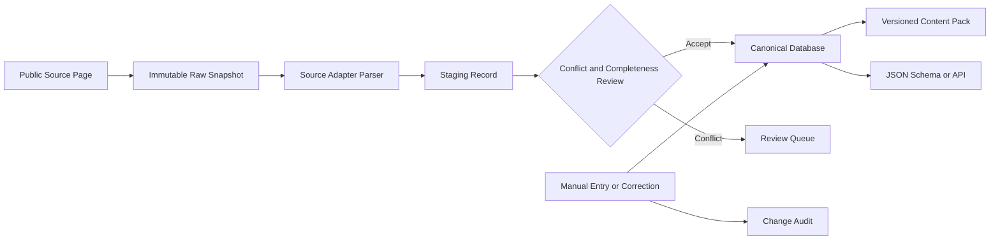

# RockPvP Creature Catalog Data Layer Implementation v1

> Implementation date: 2026-07-27  
> Scope: **Rock Kingdom: World** mobile game only  
> Status: schemas, manual curation, Content Packs, crawler framework, and the first source adapter are implemented; no production data has been crawled.

## 1. Goal

This phase delivers a maintainable, source-aware, versioned data system rather than a one-off creature JSON file:

1. Define contracts for creature number, elements, bloodlines, base stats, effort allocation, traits, and skill pools.
2. Keep skills in an independent dataset; creature skill pools reference stable `skill_id` values.
3. Separate species facts from player-editable builds.
4. Support database constraints, manual entry, corrections, audit history, and optimistic locking.
5. Support versioned Content Pack import/export, digest validation, and JSON Schema generation.
6. Write a crawler that enforces robots.txt, rate limits, and source boundaries without running a live crawl in this task.
7. Prevent classic browser-game data from entering the mobile-game catalog.

## 2. Domain Correction

Because bloodline selection and effort allocation can be changed by players, their current values do not belong directly on a species record.

The model has two layers:

- `CreatureSpecies`: encyclopedia facts such as number, name, elements, base stats, available bloodlines, available traits, and skill-pool references.
- `CreatureBuild`: player state such as selected bloodline, allocated effort, optional selected trait, and equipped skills.

This prevents a player update from overwriting the global encyclopedia, preserves version ownership, and keeps base species capability separate from an individual combat configuration.

A second critical distinction is that a **“bloodline skills” section is not a selectable bloodline definition**. A parser must not create a `Bloodline` entity just because a page contains a bloodline-skill group.

## 3. Data Flow



The layers are:

- **Raw**: immutable source responses stored by SHA-256.
- **Staging**: incomplete, source-specific candidates with parser warnings.
- **Canonical**: reviewed data that satisfies references and constraints.

Manual corrections update Canonical data and append audit events. They never overwrite Raw evidence.

## 4. Schema Design

### 4.1 Versioning and Identity

Every record belongs to a `ContentPack`:

```text
content_pack_id
game_version
schema_version
product_code = rock_kingdom_world
source_revisions
status
effective_at
content_digest
```

Machine IDs such as `creature_id`, `skill_id`, `bloodline_id`, `trait_id`, `element_id`, and `stat_id` are stable. Display names are not keys.

External page keys are also distinct from in-game numbers. The verified RocoDex page `/zh/pokedex/79` displays `No.040`, so the system records both:

- `external_entity_key = 79`
- `dex_number = 40`

### 4.2 Catalog Entities

| Entity | Main fields | Responsibility |
|---|---|---|
| `CreatureSpecies` | stable ID, dex number, localized name, status | Species-level encyclopedia facts |
| `Element` | element ID and name | Independent element dataset |
| `CreatureElement` | creature, element, position | One or two ordered elements |
| `StatDefinition` | stat ID, name, effort support | Extensible stat vocabulary |
| `CreatureBaseStat` | creature, stat ID, value state | Base/race value, never player effort |
| `Skill` | skill ID, element, category, power, accuracy, cost | Independent skill dataset |
| `CreatureSkillPoolEntry` | creature, skill ID, acquisition method, unlock condition | Many-to-many pool relationship |
| `Bloodline` | bloodline ID, name, effects | Independent bloodline definition |
| `CreatureBloodlineOption` | creature, bloodline, default flag, condition | Species compatibility |
| `Trait` | trait ID, name, effects | Independent trait definition |
| `CreatureTraitOption` | creature, trait, fixed/default flags | Species-to-trait relationship |

### 4.3 Player Build Entities

| Entity | Main fields | Constraints |
|---|---|---|
| `CreatureBuild` | build ID, creature, Content Pack, selected options, revision | Version-pinned player state |
| `BuildEffortAllocation` | build, stat ID, value | Non-negative, per-stat and total caps |
| `BuildSkillSlot` | build, slot, skill ID | Skill must be in the species skill pool |
| `EffortRules` | per-stat cap, total cap | Versioned; not invented when unknown |

No effort rules are seeded in the initial production pack because the public sources reviewed so far do not establish the actual caps.

### 4.4 Unknown-Value Semantics

Numeric catalog facts use an explicit three-state value:

```json
{
  "state": "known | unknown | not_applicable",
  "value": 0
}
```

- `known` requires a number, including a legitimate zero.
- `unknown` has no number because evidence is missing or unverified.
- `not_applicable` has no number because the field does not apply.

Missing scraper fields are therefore never silently converted to zero.

## 5. Database Implementation

SQLite is the local default; the SQLAlchemy model remains portable to PostgreSQL. The initial Alembic revision creates:

- Versioning: `content_packs`
- Catalog: `creatures`, `elements`, `stat_definitions`, `skills`, `bloodlines`, `traits`
- Relations: `creature_elements`, `creature_base_stats`, `creature_skill_pool`, `creature_bloodline_options`, `creature_trait_options`
- Builds: `creature_builds`, `build_effort_allocations`, `build_skill_slots`, `effort_rules`
- Provenance: `source_sites`, `source_pages`, `raw_snapshots`, `staging_records`, `field_evidence`, `change_audit`

Key invariants include unique dex numbers per Content Pack, referentially valid skill pools, at most two ordered elements, unique build stat allocations and skill slots, skill-pool membership for equipped skills, bloodline compatibility, and revision checks on manual updates.

## 6. Source Research

### 6.1 Source Matrix

| Source | Product identity | Coverage | Collection conclusion | State |
|---|---|---|---|---|
| [Official Rock Kingdom: World site](https://rocom.qq.com/) | First-party Tencent product identity | No public encyclopedia covering the required fields was found | Use for product identity and patch notes, not as the catalog source | Verified; no adapter |
| [RocoDex encyclopedia](https://rocodex.org/zh/pokedex/) | Unofficial Rock Kingdom: World community encyclopedia | Number, name, elements, traits, base-stat total, grouped skill pools; incomplete individual stats, effort, and selectable bloodlines | Public HTML is readable; restrict collection to public encyclopedia paths | Verified; adapter implemented; live collection disabled |
| [RocoDex sample detail](https://rocodex.org/zh/pokedex/79) | Same source | Displays `No.040`, elements, total base stats, traits, and own/bloodline/skill-stone groups | Used for field verification only; no bulk crawl | Verified |
| [Rock Kingdom: World BWiki](https://wiki.biligame.com/rocom/%E5%9B%BE%E9%89%B4) | Search-visible mobile-game encyclopedia | Search results expose catalog and creature pages; complete field coverage remains unverified | Direct page/API access returned HTTP 567 in this environment | Candidate; disabled |
| [GAMEKEE candidate](https://50167.gamekee.com/rocom/) | Related detail pages appeared in search results | Stable access and field coverage not verified | TLS/domain, robots, terms, and page structure still need verification | Candidate; disabled |

Explicitly blocked classic browser-game sources:

- [Classic browser-game site](https://17roco.qq.com/)
- [4399 classic pet encyclopedia](https://news.4399.com/luoke/luokechongwu/)

Their data must not enter the mobile canonical catalog even if it appears more complete.

### 6.2 RocoDex Policy Findings

Verified pages:

- [Encyclopedia list](https://rocodex.org/zh/pokedex/)
- [Sample detail](https://rocodex.org/zh/pokedex/79)
- [About](https://rocodex.org/zh/about/)
- [robots.txt](https://rocodex.org/robots.txt)

The `User-agent: *` policy allows `/` but disallows:

- `/api/`
- `/_nuxt/`
- `/data/`

The adapter therefore parses only `/zh/pokedex/` public HTML. It does not use internal APIs, Nuxt assets, or data paths.

The About page describes an unofficial community project, says that some material/images come from BWiki, mentions CC BY-NC-SA 4.0 for some material, and preserves Tencent's rights in game assets. Because this is not a blanket license for every field, a production collection must retain field-level provenance and attribution, confirm reuse rights, exclude game images from this phase, and distinguish permission to fetch from permission to republish.

## 7. Crawler Implementation

### 7.1 Safe Defaults

All sources are declared in `config/sources.yaml`:

- Live collection defaults to `enabled: false`.
- An unverified source cannot be enabled.
- Each source declares allowed URL prefixes, robots URL, request rate, response limits, and adapter.
- RocoDex is verified but remains disabled until the maintainer completes the final rights review.

The HTTP client enforces a contact-bearing User-Agent, robots.txt, same-host and URL-prefix allowlists, a default six requests per minute, serialized host access, bounded timeout/retries, response-size and media-type limits, and no cross-host fetching.

### 7.2 RocoDex Adapter

`rocodex_html_v1`:

- Discovers `/zh/pokedex/<number>` links from the public list.
- Requires a Rock Kingdom: World or RocoDex product marker.
- Extracts external key, displayed number, name, elements, total base stats, traits, and skill groups.
- Populates individual base stats only when explicitly listed in public HTML.
- Emits warnings instead of zeroes for missing effort, bloodline, or individual base stats.
- Keeps “bloodline skills” as a skill category rather than creating bloodline entities.

Only local fixtures were parsed in this task. `fetch-one` was not run.

### 7.3 Future Approved Execution

Offline fixture parse:

```bash
rockpvp-crawl parse-fixture \
  --source rocodex \
  --fixture tests/fixtures/rocodex/detail.html \
  --url https://rocodex.org/zh/pokedex/79
```

After reviewing robots, terms, reuse rights, and maintainer contact, explicitly enable the source and run one approved page:

```bash
rockpvp-crawl fetch-one \
  --source rocodex \
  --url https://rocodex.org/zh/pokedex/79 \
  --contact maintainer@example.com \
  --acknowledge-terms
```

The command stores an immutable Raw Snapshot and emits a Staging Record. It does not auto-promote data into Canonical tables.

## 8. Manual Curation

Initialize a database and Content Pack:

```bash
alembic upgrade head
rockpvp-data pack create \
  --id rkw_2026_07 \
  --game-version 2026.07 \
  --operator curator \
  --reason "initialize verified catalog"
```

Create referenced entities before a creature:

```bash
rockpvp-data element add --pack rkw_2026_07 --id element_fire --name 火 \
  --operator curator --reason "verified source"

rockpvp-data skill add --pack rkw_2026_07 --id skill_example --name 示例技能 \
  --element element_fire --operator curator --reason "manual verification"

rockpvp-data creature add --pack rkw_2026_07 --id creature_example --dex 40 \
  --name 示例精灵 --element element_fire \
  --operator curator --reason "manual verification"

rockpvp-data skill-pool attach --pack rkw_2026_07 \
  --creature creature_example --skill skill_example --method level_up \
  --operator curator --reason "verified skill pool"
```

Corrections use optimistic locking:

```bash
rockpvp-data creature update --pack rkw_2026_07 --id creature_example \
  --name 修订名称 --expected-revision 1 \
  --operator reviewer --reason "corrected against source"
```

Build commands include `build create`, `build update-effort`, `build select-bloodline`, and `build equip-skill`. Every mutation requires an operator and reason and appends `change_audit`.

## 9. Content Packs and JSON Schema

The empty initial pack is under:

```text
content-packs/rock-kingdom-world/initial/
```

It intentionally contains no unverified creature values, stat definitions, or effort caps.

Import, export, and validation:

```bash
rockpvp-data pack import --source <directory> \
  --operator curator --reason "reviewed import"
rockpvp-data export content-pack --pack <pack-id> --destination <directory>
rockpvp-data validate content-pack --source <directory>
rockpvp-data export json-schema --destination schemas/v1
```

The digest excludes the `content_digest` field itself and hashes canonical data with SHA-256. Export/re-import must retain the digest.

Eleven checked-in JSON Schemas include creature species, creature builds, skills, Content Packs, sources, and field evidence.

## 10. Important Paths

```text
src/rockpvp_data/domain/          Pydantic contracts
src/rockpvp_data/db/              SQLAlchemy models, repository, audit logic
src/rockpvp_data/services/        Content Pack import/export and schema generation
src/rockpvp_data/crawlers/        Source config, HTTP policy, adapters, runner
src/rockpvp_data/pipeline/        Raw, staging, reconciliation
alembic/versions/                 Database migrations
schemas/v1/                       Generated and checked-in JSON Schemas
config/sources.yaml               Source registry and browser-game blocklist
content-packs/                    Versioned datasets
tests/fixtures/                   Local fictional parser fixtures
```

## 11. Verification

Completed checks:

- Ruff passed.
- Strict mypy passed.
- 16 pytest tests passed.
- Tests use a socket guard that rejects live network access.
- Alembic upgraded a temporary SQLite database successfully.
- The manual workflow completed end to end: schema creation, pack creation, element/stat/creature/skill entry, skill-pool attachment, base stats, bloodline and effort selection, skill equipment, export, and reload validation.
- Export and reload produced the same SHA-256 digest.
- The RocoDex adapter was tested only with local fixtures; no live crawl ran.

## 12. Gaps and Recommendations

The requirements should eventually cover:

1. Forms and evolution chains, including whether forms share dex numbers, skills, or bloodlines.
2. Structured acquisition methods such as level-up, skill stone, event, and bloodline skill.
3. Field-level effective version ranges so patches never overwrite history.
4. Conflict review instead of source-order overwrite.
5. Separate copyright and object-storage design for images; images are excluded now.
6. Verified effort caps and reset rules before publishing effort configuration.
7. Whether bloodlines are global, species-specific, or conditionally unlocked.
8. Whether traits are fixed or player-selectable; the schema supports both pending verification.
9. Draft -> Reviewed -> Published governance with human review or two independent pieces of evidence.
10. Rights review before production collection because technical crawlability is not republication permission.

Recommended next steps:

1. Manually curate a small, double-verified set of creatures, skills, and element definitions into the first non-empty Content Pack.
2. Complete direct access, robots, and rights verification for BWiki/GAMEKEE before adding a second adapter.
3. Add a Staging review CLI for explicit promotion into Canonical data.
4. Model forms, evolution, structured skill effects, and field-level version validity.
5. Rehearse one real game patch through Content Pack diff, regression, and rollback.
