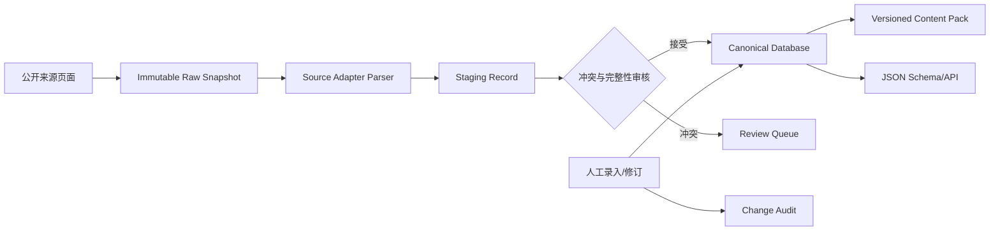

# RockPvP 精灵图鉴数据层实施文档 v1

> 实施日期：2026-07-27  
> 数据范围：仅《洛克王国：世界》手游  
> 状态：数据结构、人工维护、Content Pack、爬虫框架和首个来源适配器已完成；生产数据尚未抓取。

## 1. 建设目标

本阶段建设的不是一份一次性精灵 JSON，而是一套可持续维护、可追踪来源、可随游戏版本演进的数据系统：

1. 定义精灵编号、属性、血脉、种族值、努力值、特性和技能池的数据契约。
2. 将技能从精灵图鉴中解耦，精灵技能池只引用稳定 `skill_id`。
3. 将物种事实和玩家可变构筑分离。
4. 支持数据库约束、人工录入、人工修订、审计和乐观锁。
5. 支持版本化 Content Pack 的导入、导出、摘要校验和 JSON Schema。
6. 编写遵守 robots.txt、限速和来源边界的爬虫，但本次不运行实时爬取。
7. 明确区分手游《洛克王国：世界》和经典页游《洛克王国》。

## 2. 关键领域修正

原始需求中的“血脉”和“努力值可由玩家随时修改”意味着它们不能直接作为精灵物种记录上的当前值。

系统分成两层：

- `CreatureSpecies`：图鉴事实，包括编号、名称、属性、基础种族值、可用血脉、可用特性和技能池引用。
- `CreatureBuild`：玩家构筑，包括实际选择的血脉、努力值分配、可选特性和已装备技能。

这项拆分可以避免以下错误：

- 玩家 A 修改努力值后覆盖全局精灵图鉴。
- 某个玩家选择的血脉被误认为该精灵唯一血脉。
- 游戏版本修改种族值后，旧构筑失去所属版本。
- AI 将“物种基础能力”和“当前对战个体配置”混为一谈。

另一个需要特别区分的概念是：**“血脉技能”技能分组不等于“玩家选择的血脉”**。爬虫不能仅凭页面出现“血脉技能”就生成 `Bloodline` 实体。

## 3. 总体数据流



数据分为三层：

- **Raw**：原始响应内容按 SHA-256 不可变保存。
- **Staging**：来源适配器解析出的候选字段，允许缺失并保留警告。
- **Canonical**：经过引用校验、冲突处理和审核后可供游戏系统消费的数据。

人工修订不会覆盖 Raw 证据，只会修改 Canonical 层并写入审计记录。

## 4. Schema 设计

### 4.1 版本与标识

所有图鉴数据属于一个 `ContentPack`：

```text
content_pack_id
game_version
schema_version
product_code = rock_kingdom_world
source_revisions
status
effective_at
content_digest
```

`creature_id`、`skill_id`、`bloodline_id`、`trait_id`、`element_id` 和 `stat_id` 是稳定机器标识。显示名称不是主键；改名不改变引用关系。

来源 URL 中的数字也不能直接当精灵编号。例如已核实的 RocoDex 页面路径 `/zh/pokedex/79` 显示的是 `No.040`，因此系统分别保存：

- `external_entity_key = 79`
- `dex_number = 40`

### 4.2 图鉴实体

| 实体 | 主要字段 | 说明 |
|---|---|---|
| `CreatureSpecies` | `creature_id`、`dex_number`、名称、状态 | 精灵物种事实 |
| `Element` | `element_id`、名称 | 独立属性数据集 |
| `CreatureElement` | 精灵、属性、顺序 | 支持一至两个属性 |
| `StatDefinition` | `stat_id`、名称、是否支持努力值 | 可扩展统计项定义 |
| `CreatureBaseStat` | 精灵、`stat_id`、值和知识状态 | 种族值，不保存玩家努力值 |
| `Skill` | `skill_id`、属性、分类、威力、命中、消耗等 | 独立技能数据集 |
| `CreatureSkillPoolEntry` | 精灵、`skill_id`、获得方式、等级、条件 | 精灵与技能多对多关系 |
| `Bloodline` | `bloodline_id`、名称、效果 | 独立血脉定义 |
| `CreatureBloodlineOption` | 精灵、血脉、默认标记、条件 | 图鉴声明可选范围 |
| `Trait` | `trait_id`、名称、效果 | 独立特性定义 |
| `CreatureTraitOption` | 精灵、特性、默认/固定标记 | 精灵与特性的关系 |

### 4.3 玩家构筑实体

| 实体 | 主要字段 | 约束 |
|---|---|---|
| `CreatureBuild` | 构筑 ID、精灵、版本、选择血脉、选择特性、修订号 | 必须绑定 Content Pack |
| `BuildEffortAllocation` | 构筑、`stat_id`、分配值 | 非负、单项上限、总量上限 |
| `BuildSkillSlot` | 构筑、槽位、`skill_id` | 技能必须存在于该精灵技能池 |
| `EffortRules` | 单项上限、总量上限 | 按游戏版本配置，未核实时不编造 |

努力值规则目前没有写入生产初始包，因为公开来源尚未确认具体上限。空值代表“未知”，不代表零。

### 4.4 未知值语义

数值字段使用三态结构：

```json
{
  "state": "known | unknown | not_applicable",
  "value": 0
}
```

规则：

- `known` 必须带数值，且允许合法的零。
- `unknown` 不带数值，表示来源没有提供或尚未核实。
- `not_applicable` 不带数值，表示该字段不适用于该实体。

这样可以防止爬虫把缺失字段静默转换为零。

## 5. 数据库实现

默认数据库是 SQLite，连接 URL 可配置，SQLAlchemy 模型保持 PostgreSQL 兼容。初始 Alembic 迁移创建以下表组：

- 版本：`content_packs`
- 图鉴：`creatures`、`elements`、`stat_definitions`、`skills`、`bloodlines`、`traits`
- 关系：`creature_elements`、`creature_base_stats`、`creature_skill_pool`、`creature_bloodline_options`、`creature_trait_options`
- 构筑：`creature_builds`、`build_effort_allocations`、`build_skill_slots`、`effort_rules`
- 溯源：`source_sites`、`source_pages`、`raw_snapshots`、`staging_records`、`field_evidence`、`change_audit`

重要约束包括：

- 同一 Content Pack 中精灵编号唯一。
- 所有技能池条目必须引用同版本的技能记录。
- 属性最多两个且顺序唯一。
- 同一构筑中努力值统计项、技能槽位和已装备技能不得重复。
- 构筑技能必须属于该精灵技能池。
- 选择血脉必须属于该精灵的可用血脉集合。
- 人工修改使用 `expected_revision` 防止覆盖他人的并发修改。

## 6. 来源调研结果

### 6.1 来源矩阵

| 来源 | 产品身份 | 字段覆盖 | 抓取结论 | 当前状态 |
|---|---|---|---|---|
| [《洛克王国：世界》官网](https://rocom.qq.com/) | 腾讯官方，一手身份来源 | 未发现满足需求的公开精灵图鉴 | 可用于产品身份和版本公告，不作为图鉴主源 | 已验证，无适配器 |
| [RocoDex 图鉴](https://rocodex.org/zh/pokedex/) | 非官方《洛克王国世界》社区百科 | 编号、名称、属性、特性、种族值总和、分组技能池；六项种族值、努力值和可选血脉不完整 | 公开 HTML 可读；只允许抓取公开图鉴路径 | 已验证，已写适配器，实时抓取默认禁用 |
| [RocoDex 样例详情](https://rocodex.org/zh/pokedex/79) | 同上 | 页面显示 `No.040`、属性、种族值总和、特性、自身/血脉/技能石技能组 | 用作适配器字段核验；没有执行批量爬取 | 已验证 |
| [洛克王国世界 BWiki 图鉴](https://wiki.biligame.com/rocom/%E5%9B%BE%E9%89%B4) | 搜索结果可确认有手游图鉴页面 | 搜索可见精灵详情和图鉴入口，完整字段仍待页面级核实 | 当前环境直接页面/API访问返回 HTTP 567，不能声称已具备稳定抓取条件 | 候选，禁用 |
| [GAMEKEE 候选](https://50167.gamekee.com/rocom/) | 搜索结果出现相关详情页 | 未完成稳定页面访问和字段核验 | 域名/TLS、robots、条款和页面结构仍待确认 | 候选，禁用 |

明确排除：

- [经典页游官网](https://17roco.qq.com/)
- [4399 经典页游宠物图鉴](https://news.4399.com/luoke/luokechongwu/)

即使这些页游页面字段更完整，也不能进入手游 Canonical 数据库。

### 6.2 RocoDex 合规结论

已核实页面：

- [图鉴列表](https://rocodex.org/zh/pokedex/)
- [样例详情](https://rocodex.org/zh/pokedex/79)
- [关于页面](https://rocodex.org/zh/about/)
- [robots.txt](https://rocodex.org/robots.txt)

`robots.txt` 对 `User-agent: *` 允许 `/`，但明确禁止：

- `/api/`
- `/_nuxt/`
- `/data/`

因此实现只发现和解析 `/zh/pokedex/` 公开 HTML，禁止通过内部 API、Nuxt 资源或数据目录绕过页面边界。

关于页面将其描述为非官方社区项目，说明部分资料/图片来自 BWiki，部分内容采用 CC BY-NC-SA 4.0，同时游戏素材权利属于腾讯。由于不是所有字段都明确统一授权，真正发布采集数据前仍应：

1. 保留字段级来源和 RocoDex 署名。
2. 再确认目标字段的可再利用许可。
3. 不把游戏图片/素材直接纳入本阶段数据包。
4. 不把抓取许可等同于内容再发布许可。

## 7. 爬虫设计

### 7.1 安全默认值

所有来源配置位于 `config/sources.yaml`：

- 实时抓取默认 `enabled: false`。
- 未验证来源不能被启用。
- 每个来源声明 URL allowlist、robots 地址、请求频率、响应大小和适配器。
- 当前已验证的 RocoDex 仍保持禁用，需要维护者完成权利确认后手动启用。

HTTP 客户端具备：

- 明确的 User-Agent 和维护者联系方式。
- robots.txt 强制检查。
- 同主机和 URL 前缀 allowlist。
- 默认每分钟 6 次请求。
- 单主机串行限速。
- 有界超时、最多三次重试和指数退避。
- 最大响应大小和媒体类型限制。
- 禁止跨主机重定向式抓取。

### 7.2 RocoDex 适配器

`rocodex_html_v1` 完成：

- 从公开图鉴列表发现 `/zh/pokedex/<number>` 详情链接。
- 校验页面必须包含《洛克王国世界》或 RocoDex 产品标记。
- 提取页面路径外部 ID、页面展示编号、名称、属性、种族值总和、特性和技能分组。
- 只在公开 HTML 明确列出六项值时填充种族值明细。
- 未发现努力值、可选血脉或六项种族值时产生 warning，不填零。
- 将“血脉技能”保留为技能分组，不生成血脉实体。

本次只使用本地 fixture 测试适配器，没有运行 `fetch-one`。

### 7.3 未来获批后的运行方式

先离线校验 fixture：

```bash
rockpvp-crawl parse-fixture \
  --source rocodex \
  --fixture tests/fixtures/rocodex/detail.html \
  --url https://rocodex.org/zh/pokedex/79
```

完成 robots、条款、许可和维护者联系方式复核后，才能在配置中设置 `enabled: true` 并执行单页采集：

```bash
rockpvp-crawl fetch-one \
  --source rocodex \
  --url https://rocodex.org/zh/pokedex/79 \
  --contact maintainer@example.com \
  --acknowledge-terms
```

该命令会保存不可变 Raw Snapshot，并输出 Staging Record；不会自动写入 Canonical 数据库。

## 8. 人工录入与修改

初始化：

```bash
alembic upgrade head
rockpvp-data pack create \
  --id rkw_2026_07 \
  --game-version 2026.07 \
  --operator curator \
  --reason "initialize verified catalog"
```

录入精灵前先录入被引用实体：

```bash
rockpvp-data element add --pack rkw_2026_07 --id element_fire --name 火 \
  --operator curator --reason "verified source"

rockpvp-data skill add --pack rkw_2026_07 --id skill_example --name 示例技能 \
  --element element_fire --operator curator --reason "manual verification"

rockpvp-data creature add --pack rkw_2026_07 --id creature_example --dex 40 \
  --name 示例精灵 --element element_fire \
  --operator curator --reason "manual verification"

rockpvp-data skill-pool attach --pack rkw_2026_07 \
  --creature creature_example --skill skill_example --method level_up \
  --operator curator --reason "verified skill pool"
```

修订精灵使用乐观锁：

```bash
rockpvp-data creature update --pack rkw_2026_07 --id creature_example \
  --name 修订名称 --expected-revision 1 \
  --operator reviewer --reason "corrected against source"
```

构筑层命令包括：

- `build create`
- `build update-effort`
- `build select-bloodline`
- `build equip-skill`

所有写命令都要求 `operator` 和 `reason`，并追加 `change_audit`。

## 9. Content Pack 与 JSON Schema

初始空包位于：

```text
content-packs/rock-kingdom-world/initial/
```

它故意不包含未经验证的精灵、统计项或努力值上限。

导入、导出和校验：

```bash
rockpvp-data pack import --source <directory> \
  --operator curator --reason "reviewed import"
rockpvp-data export content-pack --pack <pack-id> --destination <directory>
rockpvp-data validate content-pack --source <directory>
rockpvp-data export json-schema --destination schemas/v1
```

摘要计算排除 `manifest.content_digest` 自身，并对规范化数据产生 SHA-256。导出再导入后摘要必须一致。

已生成 11 份 JSON Schema，包括：

- `creature-species.schema.json`
- `creature-build.schema.json`
- `skill.schema.json`
- `content-pack.schema.json`
- `source-site.schema.json`
- `field-evidence.schema.json`

## 10. 主要代码位置

```text
src/rockpvp_data/domain/          Pydantic 领域契约
src/rockpvp_data/db/              SQLAlchemy 模型、仓储、审计
src/rockpvp_data/services/        Content Pack 导入导出和 Schema 生成
src/rockpvp_data/crawlers/        来源配置、HTTP 策略、适配器和运行器
src/rockpvp_data/pipeline/        Raw、Staging、冲突协调
alembic/versions/                 数据库迁移
schemas/v1/                       生成并纳入版本控制的 JSON Schema
config/sources.yaml               来源注册表和经典页游黑名单
content-packs/                    版本化数据包
tests/fixtures/                   纯本地、虚构内容的解析 fixture
```

## 11. 验证结果

本阶段完成的验证：

- Ruff 静态检查通过。
- mypy strict 模式通过。
- 16 个 pytest 测试通过。
- 测试套件通过 socket guard 禁止真实网络连接。
- Alembic 在临时 SQLite 数据库上升级成功。
- 人工维护端到端流程成功：建库、建包、录入属性/统计项/精灵/技能、关联技能池、设置种族值、血脉和努力值、装备技能、导出和重新校验。
- 导出和重新加载的 Content Pack SHA-256 一致。
- RocoDex 适配器仅使用本地 fixture 测试，未执行实时爬取。

## 12. 需求补充与后续建议

现有需求还需要补充以下内容：

1. **形态与进化链**：同一精灵不同形态是否共享编号、技能池和血脉，需要独立实体关系。
2. **技能获得方式**：升级、技能石、活动、血脉技能等必须结构化，不能只存技能列表。
3. **版本有效期**：每个字段应能追踪首次/最后适用版本，补丁不能直接覆盖历史数据。
4. **字段级冲突策略**：多个来源值不一致时进入审核队列，不按来源顺序静默覆盖。
5. **图片与素材**：当前 Schema 不收录图片二进制；若以后需要，必须单独处理版权和对象存储。
6. **努力值规则来源**：在确认总上限、单项上限、可重置规则前保持未知。
7. **血脉规则**：需确认血脉是全局可选、精灵限定还是由其他条件解锁，再决定兼容关系约束。
8. **特性可变性**：当前 Schema 同时支持固定和可选特性，但需要实际游戏规则确认。
9. **数据发布治理**：建议实行 Draft -> Reviewed -> Published，并要求至少两条独立证据或一次人工复核。
10. **来源许可**：抓取技术可行不等于可以再发布，生产采集前应完成许可确认。

下一阶段优先级：

1. 人工录入少量经双重核实的精灵、技能和属性定义，形成第一份非空 Content Pack。
2. 与 BWiki/GAMEKEE 完成页面访问、robots 和许可核验，再决定是否增加第二来源适配器。
3. 建设 Staging 审核 CLI，将爬虫候选记录人工晋级到 Canonical 层。
4. 增加形态、进化、技能效果结构和版本字段级有效期。
5. 通过一次真实游戏补丁演练 Content Pack diff、回归和回滚。
