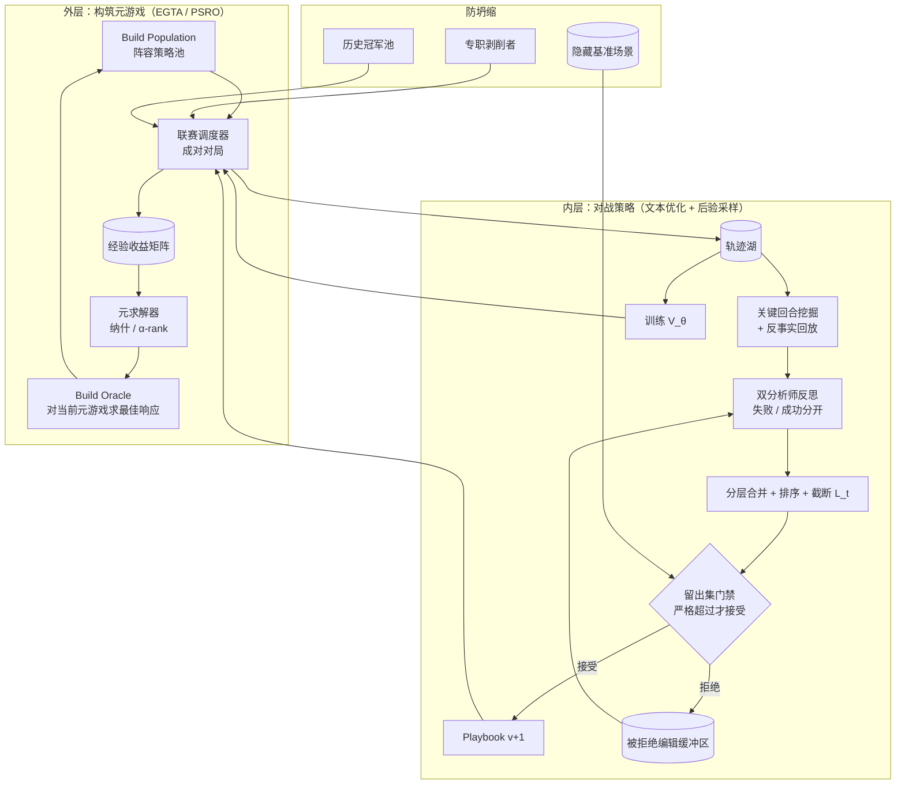

# Self-Play RL 框架设计 v1

> 状态：Superseded —— 已被 [Self-Play-RL-Plan_v2.md](Self-Play-RL-Plan_v2.md)（无参数更新方案）取代。v2 保留本文的两层自博弈骨架，替换了「模型如何变强」的算法层。本文保留作为设计演进记录。
> 定位：[RockPvP_PLAN_v1.md](../RockPvP_PLAN_v1.md) 第 9 章「自进化 Harness」的展开与细化。本文只回答一个问题——**在无法更新权重的前提下，如何让闭源前沿模型（例如 Fable 5）通过自我博弈真正变强**。
> 依赖：`docs/CREATURE_CATALOG_UPDATE_v2.zh-CN.md`（图鉴数据层 schema 2.0.0）。

---

## 1. 执行摘要

闭源模型的权重不可动，所以**所有学习成果都必须落在模型之外的可版本化工件里**。本方案把"变强"定义为三类工件的持续优化：

| 工件 | 内容 | 优化手段 | 谁来评判 |
|---|---|---|---|
| **Build Book** | 具体队伍与配置（6 精灵 + 努力值 + 性格 + 血脉 + 4 技能） | LLM 提议组合语义 + 代码做数值搜索 | 对战引擎胜率 |
| **Playbook** | 自然语言战术手册（注入决策上下文的可训练文本状态） | 有界文本编辑 + 留出集门禁 | 对战引擎胜率 |
| **Numerics** | 价值函数 `V_θ`、抽象局面的混合策略频率表、克制矩阵、伤害阈值表 | 自博弈轨迹上的回归与后悔匹配 | 交叉验证 + 可利用性 |

三条不变量贯穿全文：

1. **模型永不担任裁判。** 奖励只来自确定性对战引擎的胜负事实，绝不来自 LLM 自评。这是自博弈不崩溃的唯一保证。
2. **本游戏是两层博弈，必须分两层做自博弈。** 外层是阵容构筑的近似正规形博弈（含石头剪刀布式非传递性），内层是带隐藏信息的扩展形博弈。用同一个循环同时优化两层会互相污染信号。
3. **"打赢上一代"不是目标，"降低可利用性"才是。** 攻击/防御/状态的相对克制关系 + 能量回复的抢节奏，天然产生非传递环。朴素自博弈（只对抗最新版本）会在环上打转并产生虚假进步。必须用**联赛 + 优先级虚构自博弈 + 专职剥削者**来度量真实强度。

---

## 2. 为什么不能直接照搬 AlphaZero 式自博弈

在动手前先确认这个游戏的博弈结构，因为它决定了算法选择。

| 游戏性质 | 本项目的情况 | 对方案的约束 |
|---|---|---|
| 完美信息？ | **否**。对手 6 只精灵的配置、剩余技能、能量、努力值分配对我方隐藏 | 不能用纯 minimax/MCTS 求解；需要信念状态与混合策略 |
| 同时行动？ | **是**（每回合双方同时提交技能或换人） | 存在纳什均衡意义下的混合策略；确定性策略可被读穿 |
| 传递性强度？ | **弱**。攻击/防御/状态相对克制 + 元素克制 + 血脉，产生非传递环 | 朴素自博弈会循环；必须用联赛 Elo + 可利用性度量 |
| 可微？ | **否**（闭源权重） | 学习必须外化为文本/表格/小模型 |
| 环境可仿真？ | **是**（自研规则引擎，固定种子可重放） | 可无限量生成对局，rollout 成本主要是 LLM token 而非环境 |
| 奖励密度？ | **稀疏**（终局胜负），但可派生密集代理（血量差、能量差、命数差） | 需要信度分配机制把终局结果归到具体回合 |

**结论**：这是一个「黑盒先验 + 可验证环境 + 弱传递性 + 不完美信息」的组合。对应的正确技术组合是：

```
外层（构筑）：  经验博弈论分析（EGTA）+ 双 Oracle / PSRO
内层（对战）：  文本策略优化（SkillOpt 式有界编辑 + 门禁）
              + 采样期后验引导（AMC 式 SMC + 学习价值函数）
信度分配：      终局胜负 → 关键回合定位 → 反事实回放
防坍缩：        优先级虚构自博弈 + 专职剥削者 + 隐藏基准
```

---

## 3. 学习对象定义：什么在"变强"

模型不变，变的是下面这些工件。每个都必须是**不可变、带版本、可回滚**的。

### 3.1 Playbook（自然语言策略手册）

这是主要的学习载体，对应 SkillOpt 的 "skill-as-trainable-state"：把一段自然语言策略前置到决策上下文，当作冻结模型的可训练状态来优化文本本身。

结构（建议 800–2,000 token，硬上限 2,500）：

```markdown
# playbook v_037
## [PROTECTED] 核心原则          # 只有 epoch 级慢更新可写
- 能量是本游戏的真实资源，血量只是能量的兑现形式
- ...
## 开局与首发选择
## 换人时机（含换人代价的量化门槛）
## 三类技能的相对克制读法（不是必胜，是概率优势）
## 能量管理与回能时机
## 对手建模：从对手前 3 回合推断其配置倾向
## 残局（对手剩 1 命时）
## 已知反模式                    # 来自被拒绝编辑缓冲区
```

关键设计：

- **[PROTECTED] 区域**：epoch 边界的慢更新写入，快速步进编辑不得覆盖。防止好规则被后续噪声抹掉。
- **有界编辑**：每步最多 `L_t` 条编辑（初始 3，按余弦退火到 1）。无界重写会擦掉好规则并过拟合。任何适度的有界预算都优于无预算重写。
- **被拒绝编辑缓冲区**：被门禁拒绝的编辑连同其分数下降一起存档，作为下一轮反思的负面证据。零部署成本。
- **Meta Playbook**：一份只给优化器看、永不上线的"如何做编辑"的教练手册。

### 3.2 Build Book（阵容与配置库）

不是一份最优队伍，而是一个**带元数据的策略池**：

```yaml
build_set_id: bs_112
archetype: energy_denial          # 战术原型标签
creatures:
  - creature_id: ...
    trait_id: ...                  # 特性
    bloodline_element_id: ...       # 18 系中选一
    effort_allocations: [...]       # 三维各 +21~30，受 effort_rules 约束
    nature: ...                     # 性格加成
    equipped_skills: [4 个 skill_id]
    role: opener | pivot | sweeper | wall | energy_battery
counters: [bs_098, bs_103]          # 经验克制关系（从联赛矩阵得出）
countered_by: [bs_077]
meta_share: 0.12                    # 在当前元游戏纳什均衡下的建议出场频率
```

`counters` / `countered_by` / `meta_share` 全部由联赛的**经验收益矩阵**算出，不由 LLM 断言。

### 3.3 Numerics（数值工件）

| 工件 | 用途 | 训练方式 |
|---|---|---|
| `V_θ` 价值函数 | 给定局面输出胜率估计，用于 SMC 重采样和关键回合定位 | 小模型（3B–11B，LoRA + 回归头）在自博弈轨迹上回归；单轨迹 hard-max 目标即可 |
| 抽象局面策略表 | 对抽象化的局面桶给出动作混合频率 | 自博弈上的后悔匹配（CFR 风格），只在抽象空间做 |
| 伤害/阈值表 | 一击必杀线、两回合击杀线、能量回本回合数 | 规则引擎穷举，纯代码 |
| 元游戏均衡 | 构筑层混合策略 | 经验收益矩阵上解纳什/α-rank |

`V_θ` 是本方案里唯一有梯度的部分——它是"外挂的廉价学习器"，让被冻结的大模型可以被引导。一个小价值模型足以引导一个它从未训练过的巨大黑盒先验。

---

## 4. 两层自博弈架构



### 4.1 为什么必须分层

构筑决策和对战决策的信号时间尺度差 2–3 个数量级：

- 一次构筑决策影响整场（甚至整个联赛周期）；样本效率极低，一场对局只给出 1 bit。
- 一次回合决策影响几十回合中的一个；一场对局给出 40–60 个决策样本。

混在一起优化，构筑的噪声会淹没对战的信号；反之构筑层会把对战失误误判为配置错误。因此：

- **内层先收敛**：固定一组人工/启发式构筑（`bs_seed_01..08`），只优化 Playbook 与 `V_θ`。
- **外层后启动**：内层策略稳定后，冻结 Playbook，只做构筑搜索。
- **交替迭代**：之后按 epoch 交替，每次只解冻一层（坐标上升）。这是本方案里最重要的工程纪律。

---

## 5. 内层：对战决策的自我提升

### 5.1 数据划分（先立规矩，否则后面所有数字都不可信）

| 划分 | 用途 | 内容 | 禁止 |
|---|---|---|---|
| `D_tr` | 产生经验、反思 | 自博弈对局 + 关键回合 | — |
| `D_sel` | 门禁选择编辑 | 固定 200 个局面 + 60 场固定种子对局 | 不进反思上下文 |
| `D_test` | 只用于汇报 | 人工设计的反套路场景 + 隐藏阵容 | 不进任何优化输入 |

按**阵容族与场景族**隔离，不按对局隔离——否则同一阵容的对局会跨集泄漏。`D_test` 每季度替换 30%。

### 5.2 单步优化循环（fast step）

一个 step 的完整流程：

**① Rollout 批次**
- 用当前 `playbook_v` 跑 `B` 场自博弈（初始 `B=32`）。
- 对手从「优先级虚构自博弈」分布采样（见 §7.1），不是只打最新版本。
- 每场固定种子、固定 `content_pack_digest`，全程事件溯源。
- Batch size 就是证据噪声的控制旋钮：太小则反思在噪声上学习。

**② 关键回合定位（信度分配）**

这是稀疏奖励下的核心难点。三种手段联合，按成本从低到高：

1. **价值落差法**：用 `V_θ` 扫全场，标记 `V(s_t) - V(s_{t+1})` 下降最大的 top-k 回合。便宜，覆盖广。
2. **反事实回放**：在候选关键回合处，固定其余所有输入，替换为另一个合法动作，重跑 `M` 次（不同种子）。若替代动作胜率显著更高 → 确认为错误决策，并得到一个更优动作标签。贵但产生真标签。
3. **预测校准偏差**：模型自报高置信但结算大幅偏离的回合（`DecisionResponse.prediction` vs 实际事件）。指向的是**认知错误**而非运气，反思价值最高。

三者交集优先。产出结构化的「关键回合卡片」：

```json
{
  "trajectory_id": "...", "turn_no": 23,
  "situation_abstract": "自方能量 2/己方剩 2 命/对手场上高速攻击型",
  "chosen": "use_skill:attack_x",
  "counterfactual_better": "switch:creature_4",
  "delta_winrate": 0.19, "n_replays": 24,
  "diagnosis_hint": "在能量不足时选择了攻击而非换人续航"
}
```

**③ 双分析师反思（失败与成功分开）**

两个独立的 LLM 分析器，各自只看一类证据：

- **Failure Analyst**：只看失败关键回合卡片 + 被拒绝编辑缓冲区。产出候选编辑 + 每条的失败机制假设。
- **Success Analyst**：只看成功关键回合卡片。产出应当**固化**的规则（这类规则最容易在无界重写中被误删）。

分开的理由：混在一起时失败信号会主导，成功经验被稀释；而且成功侧的规则往往需要"保护"而非"新增"。

**④ 分层合并 + 有界截断**

- 合并时**失败优先**（failure priority），但成功侧的"保护提案"可以升级为 [PROTECTED] 候选。
- 对候选编辑按 (证据条数 × 平均 `delta_winrate` × 场景覆盖度) 排序。
- 截断到 `L_t` 条。`L_t` 从 3 余弦退火到 1。

**⑤ 留出集门禁（propose-and-test）**

对每条候选编辑（以及组合）在 `D_sel` 上评测：

- **只有严格优于**当前 playbook 的选择分数才接受。平手一律拒绝——防止无声漂移。
- 文本上看起来合理的诊断，落到真实模型上完全可能变差。每条都必须真测。
- 被拒绝的编辑连同分数下降写入被拒绝缓冲区。

选择分数（`D_sel` 上）：

```
score = 0.70 · 配对胜率(vs 冠军 + 历史池加权)
      + 0.15 · (1 - 可利用性)          # 被剥削者攻击后的胜率保持
      + 0.10 · 预测校准(1 - Brier)
      + 0.05 · 合法率与降级率的健康度
```

配对对局（同种子、双向先后手交换）是必须的，否则 60 场的噪声吃掉一切效应。

### 5.3 Epoch 边界：慢更新与 Meta Playbook

每 `E` 个 step（初始 `E=8`）做一次慢更新，对应"动量"：

1. 汇总本 epoch 所有**被接受**的编辑与其真实增益。
2. 把反复被验证、跨阵容成立的规则提炼进 **[PROTECTED] 区域**——步进编辑无法覆写。
3. 更新 **Meta Playbook**（只给优化器）：本 epoch 哪类编辑经常被拒绝、哪类诊断方向反复奏效。它永不上线，只用来提高后续编辑的命中率。
4. 重训 `V_θ`（用累积的新轨迹）。
5. 在 `D_test` 上跑一次汇报评测（不用于任何决策）。

### 5.4 推理期增强：SMC 引导采样（可选，成本换胜率）

以上是"离线学到一份好 playbook"。在关键回合还可以在**采样期**直接向更优策略偏移，且完全不动权重：

把 KL 正则化 RL 视作贝叶斯推断——最优策略 `π*(s_{0:T}) ∝ π(s_{0:T}) · e^{r/β}`，其中**先验**就是冻结的黑盒模型，**似然**是指数化奖励。既然无法优化先验的参数，就改为**从后验采样**：

- 在标记为关键的回合，从先验并行采样 `N` 条候选动作序列（默认 `N=15`）。
- 用 `V_θ` 计算重要性权重，做**序列重要性重采样**（剪掉最差的，复制最好的）。
- **稀疏、定点重采样优于频繁或 ESS 动态重采样**——在分数和成本上都更优。本项目的固定重采样点建议：换人决策点、能量归零点、对手剩 1 命时。

适用边界要诚实：这套方法在**先验"好但不完美"**时收益最大；先验在简单局面上本已接近饱和时收益会消失甚至反转。因此只在 `V_θ` 判定为高不确定性的回合启用，其余回合走单次调用。

---

## 6. 外层：阵容与配置的自我提升

### 6.1 三级搜索空间分解

完整配置空间是天文数字（图鉴规模 × 技能池组合 × 努力值分配 × 性格 × 血脉 × 6 只队伍组合）。分三级，把 LLM 用在它擅长的地方：

| 级别 | 空间 | 谁来搜 | 理由 |
|---|---|---|---|
| L1 战术原型 | ~20 个原型（能量压制/高速强攻/耐久消耗/状态控制…） | **LLM 提议** | 语义与创造性组合，需要理解技能描述与特性文本 |
| L2 精灵与技能选择 | 给定原型下的 6 只 + 各 4 技能 | **LLM 提议 + 代码约束校验** | 需要读懂 `skill_pool`、`trait_options`、血脉限制 |
| L3 数值分配 | 努力值（三维各 +21~30）、性格、血脉系别 | **纯代码搜索**（CMA-ES / 局部搜索 + 阈值表剪枝） | 纯数值优化，LLM 手算必然出错 |

L3 必须交给代码：成熟的规则、搜索与概率计算应由代码实现，LLM 只负责决定何时调用与如何解释结果。努力值的最优解往往由"能否跨过某个一击必杀阈值"决定，这是可枚举的。

### 6.2 双 Oracle 循环（PSRO 风格）

```
初始化：种子阵容池 P = {bs_seed_01..08}（人工 + 启发式，覆盖不同原型）
循环：
  1. 联赛：P 中所有配对互打（每对 N 场，双向先后手，多种子）→ 经验收益矩阵 A
  2. 元求解：在 A 上解混合策略 σ*（纳什 / α-rank / 或正则化 σ 防早期过拟合）
  3. Build Oracle：求对 σ* 的近似最佳响应
     a. LLM 读取 σ* 中高权重阵容的公开特征 → 提议 3~5 个 L1 原型
     b. LLM 在约束下实例化 L2（引用真实 creature_id / skill_id，schema 校验）
     c. 代码搜索 L3 数值
     d. 每个候选对 σ* 采样对战评测
  4. 门禁：候选对 σ* 胜率 > 55% 且未被现有池中任一成员以 >70% 压制 → 入池
  5. 淘汰：α-rank 长期为 0 且不构成任何克制关系的成员退役（但保留在历史池用于回归）
直到：新 Oracle 无法找到超过阈值的最佳响应（元游戏近似闭合）
```

**关键：`σ*` 本身就是学习成果。** 它给出"在当前元中每个阵容该以多少频率使用"，直接对应非传递性游戏中的正确打法——出一个混合策略，而不是一个"最强队"。

### 6.3 非传递性的显式管理

攻击/防御/状态的相对克制关系保证了非传递环的存在。必须**主动度量**而非假装不存在：

- 每轮联赛后计算收益矩阵的**反对称分量占比**。占比越高说明非传递性越强，越不能相信单一 Elo。
- 维护 **克制图谱**（有向图，边权 = 配对胜率 - 0.5）。检测三元环并记录到 Build Book 的 `counters` 字段。
- 汇报时**同时给出** Elo（传递强度）与 α-rank（非传递鲁棒性）。两者排序冲突时以 α-rank 为准。

---

## 7. 防坍缩机制（本方案的成败关键）

朴素自博弈的三种失败模式，以及对应的防御：

| 失败模式 | 表现 | 防御 |
|---|---|---|
| 策略循环 | 每代都打赢上一代，但 v10 打不过 v3 | 优先级虚构自博弈（§7.1） |
| 过拟合自身 | 只会打自己的镜像，遇到陌生打法崩盘 | 专职剥削者 + 风格对手池（§7.2） |
| 评测污染 | 分数一直涨，真实强度不涨 | 三集隔离 + 隐藏基准 + 定期换血（§5.1） |

### 7.1 优先级虚构自博弈（PFSP）

对手不从"最新版本"采样，而从**整个历史池**按权重采样：

```
P(选择对手 o) ∝ f( winrate(current, o) )
其中 f(x) = (1 - x)^p     # p ≈ 2
```

含义：越难打的历史对手被采样得越多；已经稳赢的对手仍保留小概率（防遗忘）。对手池组成建议：

- 40% PFSP 采样的历史 Playbook 版本
- 20% 当前冠军（自身镜像）
- 20% 专职剥削者
- 10% 固定启发式 Bot（合法性与下限的地板）
- 10% 人工设计的极端风格（纯攻击流 / 纯状态流 / 纯能量压制）

### 7.2 专职剥削者（Exploiter）

单独训练的、**唯一目标是打爆当前冠军**的策略分支。它不进入主线，不参与晋级，只做两件事：

1. **找漏洞**：它的胜率就是冠军的**可利用性**度量，直接进入 §5.2 的选择分数。
2. **当陪练**：它的对局回放注入主线的对手池。

每 2 个 epoch 重置一次剥削者（从冠军 fork 后专门优化），避免它自己也过拟合。

### 7.3 数值健康度看板

必须持续监控（异常即暂停自博弈）：

- **动作熵**：策略是否坍缩成单一动作。同时行动博弈中过低的熵会被读穿。
- **换人率**：塌到 0 或飙到极高都是退化信号。
- **能量利用率**：回能技能的使用频率是否落在合理区间。
- **对局长度分布**：突然变短通常是双方都在乱打。
- **传递性指标**：收益矩阵反对称分量的趋势。

---

## 8. 奖励设计

主奖励只有一个：**终局胜负**（来自确定性规则引擎）。这是不可协商的锚点。

但稀疏奖励下信度分配困难，因此引入**仅用于诊断和 `V_θ` 训练**的密集代理信号，它们绝不直接作为优化目标：

```
r_terminal = +1 / -1                                  # 唯一优化目标
shaping（只喂 V_θ 与关键回合挖掘）：
  Δ(命数差)      权重最高，最接近真实目标
  Δ(血量差 / 最大血量)
  Δ(能量差)      本游戏的特色资源
  Δ(场上精灵的期望交换价值)
```

为什么严格区分：任何 shaping 都会引入偏置，而在自博弈里偏置会被双方共同放大（双方都学会刷代理指标而不是赢）。所以 shaping 只用于**定位该分析哪个回合**和**训练价值函数**，胜负才决定编辑是否被接受。

同理，**禁止 LLM 自评作为奖励**。LLM 评委在自博弈里会与被评策略共同漂移，产生看起来在涨的假分数。产生候选的模型不能同时是唯一评委。

---

## 9. 评测协议

### 9.1 评测矩阵

每个候选 Playbook 或 Build Set 晋级前必须跑完：

| 维度 | 内容 |
|---|---|
| 对手 | 当前冠军、3 个历史冠军、专职剥削者、启发式 Bot、3 种极端风格 |
| 阵容 | 至少 5 个战术原型 × 双方各自采样 |
| 种子 | ≥ 20 个固定种子，先后手全交换（配对对局） |
| 场景 | 100 个人工关键局面（含能量枯竭、残局、被状态压制） |
| 故障 | 模型超时、坏 JSON、非法动作、工具失败四类注入 |
| 版本 | 当前 `content_pack_digest` + 一个历史版本 |

### 9.2 晋级门禁

```
必要条件（全部满足）：
  1. 规则与协议测试 100% 通过；非法动作率 ≤ 冠军
  2. 对 σ* / 冠军的配对胜率提升达到统计显著（配对 bootstrap，或序贯检验 SPRT）
  3. 可利用性（被剥削者攻破率）不显著上升
  4. 历史池无严重回归（对任一历史冠军胜率不低于 45%）
  5. 预测校准不显著恶化（Brier score）
  6. 延迟与成本在预算内，或胜率增益达到预设交换比
  7. 动作熵不低于健康区间下界
晋级路径：Challenger → 影子运行 → 小流量灰度 → Champion
注册表保留一键回滚。
```

用 **SPRT（序贯概率比检验）** 而非固定场次：强候选早停晋级、弱候选早停拒绝，能省下大量对局成本。

### 9.3 汇报纪律

任何"提升了 X%"的结论必须附带：样本量、种子范围、置信区间、对手构成、数据集版本。缺一不可信。

---

## 10. 工程实现规划

### 10.1 复用与新增

复用 [RockPvP_PLAN_v1.md](../RockPvP_PLAN_v1.md) 已定义的：`TurnObservation` / `DecisionResponse` / `TurnSettlement` 协议、事件溯源、Content Pack、Model Gateway、Fake Model。

新增模块：

```text
packages/
  selfplay/
    league/          # 联赛调度、收益矩阵、元求解器（纳什 / α-rank）
    oracle/          # Build Oracle：L1/L2 LLM 提议 + L3 数值搜索
    optimizer/       # Playbook 优化器：反思 / 合并 / 截断 / 门禁
    credit/          # 关键回合挖掘、反事实回放、价值落差
    valuefn/         # V_θ 训练与推理服务
    exploiter/       # 专职剥削者分支
    smc/             # 推理期序列重要性重采样（可选）
artifacts/
  playbooks/         # 不可变版本 + 被拒绝编辑缓冲区
  build-books/
  value-models/
  payoff-matrices/
benchmarks/
  d-sel/             # 门禁集
  d-test/            # 隐藏集（CI 不可读）
```

### 10.2 分阶段计划

| 阶段 | 目标 | 交付 | 退出标准 |
|---|---|---|---|
| **S0** 环境就绪 | 图鉴数据可用 + 规则引擎可对战 | 填充 content pack（当前 `creatures.json` 等仍为空）；实现能量/技能三分类/换人/4 命的确定性结算；固定种子重放 | 1,000 场自动对局零非法动作，重放哈希 100% 一致 |
| **S1** 基线与度量 | 先能测量，再谈提升 | 启发式 Bot、LLM Bot（无 Playbook）、Elo/α-rank、配对评测、`D_sel`/`D_test` 建立 | LLM Bot 显著优于随机、可稳定区分强弱策略 |
| **S2** 内层闭环 | Playbook 优化跑通 | 关键回合挖掘 + 反事实回放 + 双分析师反思 + 有界编辑 + 门禁 | 完整跑通一次「接受」与一次「拒绝」，且提升在 `D_test` 上复现 |
| **S3** 价值函数 | 信度分配与不确定性识别 | `V_θ` 训练管线、价值落差定位、健康度看板 | `V_θ` 中局胜率预测 AUC ≥ 0.75；关键回合定位准确率优于随机基线 |
| **S4** 防坍缩 | 真实强度而非循环进步 | PFSP 对手池、专职剥削者、传递性指标 | v_latest 对所有历史版本胜率 ≥ 45%；可利用性可度量且下降 |
| **S5** 外层构筑 | 元游戏搜索 | 联赛 + 收益矩阵 + 元求解 + Build Oracle（L1/L2/L3） | 至少一轮 PSRO 产出新阵容入池并改变 σ* |
| **S6** 交替迭代 | 两层协同 | 坐标上升调度、epoch 慢更新、Meta Playbook | 连续 3 个 epoch 在 `D_test` 上单调提升 |
| **S7** 推理期增强 | 成本换胜率 | SMC 重采样、关键回合触发器、成本核算 | 单位成本胜率优于同成本的单次调用基线 |

S0–S1 是硬前置：**在能可靠测量强弱之前，任何自博弈都是在噪声上做梯度下降。**

### 10.3 成本控制

自博弈的主要成本是 LLM token。控制手段（按性价比排序）：

1. **对手用便宜档位**：只有被优化的一方用前沿模型，对手方用快模型或启发式。
2. **提示缓存**：Playbook + 图鉴静态部分是每回合重复的大块前缀，必须缓存。
3. **分级决策**：低不确定性回合（`V_θ` 高置信）走单次调用甚至纯启发式，只在关键回合花预算。
4. **反事实回放复用**：同一局面的多次回放共享前缀。
5. **SPRT 早停**：弱候选不跑满场次。

预算建议：一个 step（32 场对局 + 关键回合挖掘 + 反思 + 门禁 60 场）应控制在可接受的单步成本内，并按 step 记账。整个优化过程的目标是**少量高质量编辑**——学到的技能往往只需 1–4 次被接受的编辑就能产生显著提升，不要期待也不要允许大规模重写。

---

## 11. 风险与缓解

| 风险 | 影响 | 缓解 |
|---|---|---|
| 图鉴数据为空（当前状态） | 整个方案无法启动 | S0 硬前置；先填充最小可玩子集（~20 精灵 / 40 技能） |
| 规则引擎与真实游戏不一致 | 学到的策略在真实环境失效 | 规则引擎版本化 + 与真实对局的一致性抽样校验 |
| 自博弈策略循环 | 假进步 | PFSP + 历史池回归门禁 + 传递性指标 |
| Playbook 膨胀 | 延迟与成本上升、注意力稀释 | 硬 token 上限 + 有界编辑 + 定期压缩（压缩本身也要过门禁） |
| LLM 提议的配置违反规则 | 无效候选浪费预算 | 所有 L2 提议先过 `creature-build.schema.json` + 血脉/努力值/技能池约束校验，再进评测 |
| `V_θ` 与冠军共同漂移 | 关键回合定位失效 | `V_θ` 定期用新分布重训；用反事实回放交叉验证其定位质量 |
| 评测噪声导致错误晋级 | 能力倒退 | 配对对局 + 多种子 + SPRT + 严格超过才接受（平手拒绝） |
| 门禁集过拟合 | `D_sel` 涨 `D_test` 不涨 | 三集隔离 + `D_test` 定期换血 + 只用 `D_test` 汇报 |
| 前沿模型行为版本变化 | 历史结论失效 | 固定模型 ID 与参数进策略版本；模型升级触发全量重评 |

---

## 12. 关键决策记录

- **ADR-S1：学习成果外化，不微调基础模型。** 闭源权重不可动是给定条件。把大模型冻结，所有学习放进廉价的外部助手——文本策略手册与价值函数；优化一次，无需权重变更即可部署与复用。
- **ADR-S2：奖励只来自确定性引擎。** 拒绝 LLM 自评奖励。代价是必须先有可靠规则引擎（S0）。
- **ADR-S3：构筑与对战分层交替优化。** 拒绝端到端联合优化。代价是收敛较慢，但信号可归因。
- **ADR-S4：文本编辑必须有界且过门禁。** 拒绝无预算重写。平手即拒绝，防止无声漂移。
- **ADR-S5：以可利用性而非代际胜率为主指标。** 拒绝"打赢上一代即为进步"。代价是需要维护剥削者与历史池。
- **ADR-S6：数值优化交给代码，语义组合交给 LLM。** 努力值/性格/血脉搜索不走 LLM。

---

## 13. 启动前需确认的问题

1. 规则引擎是自研仿真，还是需要对接真实客户端？（决定 S0 工作量与奖励可信度）
2. 能量系统的具体机制：上限、每回合自然回复量、回能技能的收益曲线？（决定 `V_θ` 特征与阈值表）
3. 三类技能的克制关系是固定倍率，还是与元素/特性交互？（决定抽象局面桶的设计）
4. 换人是否消耗回合、是否有入场代价？（换人代价决定内层策略空间的形状）
5. 「4 条命」与 6 只精灵的关系：命数是否与具体精灵绑定，可否复活？
6. 阵容构筑是赛前一次性决定，还是可以在对局中调整？（决定外层是否为真正的正规形博弈）
7. 单场对局的算力/时间预算，以及整个自博弈项目的总 token 预算？（决定 `B`、`N`、回放次数 `M`）
8. 是否允许把学到的 Playbook 作为人类可读的攻略产出？（影响可解释性优先级）

