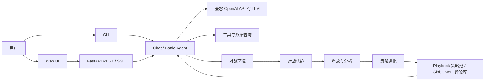

# Roco PVP Agent

[](https://www.python.org/)
[](LICENSE)

<!--
配置 CI 后启用测试徽章：
[](https://github.com/L-chang-an/Roco-PvP-Agent/actions/workflows/tests.yml)
-->

Roco PVP Agent 是一个围绕精灵组队、回合制对战与 LLM 策略进化构建的实验性 Agent 项目。项目包含可独立运行的确定性对战引擎、组队顾问（Chat Agent）、Web 界面、人类与 Agent 对战、Agent 自博弈、轨迹重放，以及带评测门禁的策略进化管线。

> [!IMPORTANT]
> 本项目目前处于研究与开发阶段。自进化、价值评估和长期记忆等功能应视为实验能力；任何“策略提升”结论都需要在真实模型、独立数据集和完整评测上下文下复验。

## 目录

- [项目简介](#项目简介)
- [核心功能](#核心功能)
- [系统架构](#系统架构)
- [快速开始](#快速开始)
- [使用方法](#使用方法)
- [配置说明](#配置说明)
- [数据与输出](#数据与输出)
- [项目结构](#项目结构)
- [开发与测试](#开发与测试)
- [版本信息](#版本信息)
- [未来规划](#未来规划)
- [贡献指南](#贡献指南)
- [安全与隐私](#安全与隐私)
- [常见问题](#常见问题)
- [开源协议](#开源协议)
- [免责声明](#免责声明)

## 项目简介

本项目希望为精灵对战场景提供一套可运行、可重放、可评测、可扩展的 Agent 基础设施。它由三线 + UI 组成，共享同一套引擎与数据指纹：

- `environment`：负责精灵数据、队伍校验、战斗规则、状态转移、迷雾视角和确定性重放（纯 Python、零引擎依赖）；
- `roco_pvp_agent`：负责 Chat Agent、LLM 接入、组队顾问、对战玩家、自博弈和策略进化；
- `ui`：提供聊天、组队、对战和观战页面，以及对应的 REST/SSE 接口。

项目既可以在没有 API Key 的情况下运行确定性离线模式，也可以连接兼容 OpenAI Chat Completions API 的模型服务。

### 适用场景

- 查询和讨论精灵、技能、阵容及对战策略；
- 构建并校验合法队伍，获取可溯源、可回归的组队建议；
- 与随机、测试 Agent 或真实 LLM 玩家对战；
- 运行 Agent 自博弈并保存可重放轨迹；
- 分析关键回合、反事实动作和策略弱点；
- 研究全局对局经验（GlobalMem）、情境记忆、策略池和长期策略进化。

### 项目状态

| 能力 | 当前状态 | 说明 |
|---|---|---|
| Chat CLI / Web | 可用 | 支持多轮历史、SSE/CLI 实时进度、工具调用、555 秒墙钟预算和异常降级 |
| 组队顾问 | 可用 | catalog 查询 DSL + validate 硬闸 + 轨迹证据 + 结构化终结 + 越界拒答 |
| 精灵组队 | 可用 | 支持精灵、技能、血脉、性格和个体值配置与校验 |
| 对战引擎 | 可用 | 支持状态推进、迷雾视角、事件过滤和确定性重放 |
| 人类与 Agent 对战 | 可用 | 支持 Random 与 FakeLLM 对手（真实 LLM 对手尚未接入 UI） |
| Agent 自博弈 | 可用 | 支持轨迹保存和重放自检 |
| Playbook | 实验性 | 通用对战经验手册 |
| 策略进化（GlobalMem 路线） | 实验性 | 全局经验检索/注入/复盘/编排闭环 |
| 长期记忆 | 实验性 | 默认关闭，需显式指定目录启用 |
| 提示缓存观测 | 可用 | 跨网关提取缓存命中率；网关不上报时明确标注而非假装 0 |
| 生产级公网部署 | 尚未支持 | 当前默认面向本地运行，缺少完整认证和多租户隔离 |

## 核心功能

### 组队顾问（Chat Agent）

- CLI 单轮问答和交互式会话；
- Web 端按模型轮次展示折叠卡片，分别显示同轮思考摘要和工具执行摘要；SQLite 保存会话，支持侧栏管理、独立地址、跨重启续聊和停止；队伍看板支持保存、下载与组队页编辑；
- 基于工具调用的 Agent 循环；
- CLI/Web 实时展示安全的阶段摘要与工具调用（不展示原始思维链）；
- 顾问默认最多 100 轮，信息足够即可结束，整体墙钟预算 555 秒；超时或模型异常仍返回已取得的执行结果；
- 白名单查询 DSL（`search_spirits`）+ 精灵/技能档案 + 合法构筑项；
- `validate_team` 结构化硬闸（未过校验的阵容绝不输出为推荐）；
- 轨迹证据（版本闸/重放闸，人机与自博弈分开统计）；
- `analyze_team` / `simulate_matchups` 确定性分析；
- `submit_team_advice` 结构化终结（含证据溯源）+ `final_answer` 闲聊终结；
- ScopeGate 越界拒答（注入/越界/模糊/问候走固定模板，不进 LLM）；
- 会话历史、重置和 token 使用统计；
- 未配置 API Key 时自动进入离线模式。

### 精灵与组队

- 按名称、编号和系别搜索精灵；
- 选择精灵可学习的技能；
- 配置血脉、性格和个体值；
- 校验队伍规模、技能合法性、家族冲突和战斗规则；
- 保存、加载和删除本地队伍；
- 保存前使用服务端规则重新校验。

### 对战与重放

- 支持人类与 Random、FakeLLM 或真实 LLM 对战；
- 双方玩家使用隔离的观测视角（迷雾）；
- 支持技能、换人、道具和阵亡补位；
- 对局按回合保存动作、事件和状态哈希；
- 可从初始规则、队伍、seed 和动作序列确定性重放；
- 提供观战页面查看 Agent 对战过程。

### 自博弈与策略进化

- 多局 Agent 自博弈和轨迹落盘；
- 配对评测（d_sel / d_test）+ 95% CI（Wilson 区间）；
- 关键回合识别、价值落差和反事实评估；
- 情境记忆（局部）注入与采纳归因（Q 值更新）；
- 提示缓存观测（跨网关命中率提取，可验证 token 是否被浪费）。

进化载体目前有两条并行路线：

**GlobalMem 路线**

「全局对局经验」每场按双方阵容画像（`matchup_key`）检索 Top-1
注入 system prompt，战后由分析型 LLM 分别从双方视角复盘并决定更新/新建/跳过：

- 按阵容相似度检索 + 版本硬隔离（`data_digest`）；
- append-only + `supersedes`：更新不销毁旧文本，可回滚；
- 单条 token 上限可配（默认 400），超限拒绝而非截断；
- 双视角复盘互不可见（迷雾口径，避免编码对手隐藏信息）；
- 周期性 A/B（开/关 GlobalMem 对比）作为有效性证据。

> Build Oracle、PSRO 元游戏、关键回合 SMC 与持续运行属后续规划，尚未实装。
> LLM 自选阵容同样列为未来工作，当前只从固定实例池取阵容。

## 系统架构



关键数据流：

```text
用户输入 → 组队顾问 → ScopeGate / 工具 / LLM → 结构化建议或闲聊回复
队伍配置 → 规则校验 → BattleSession → 回合事件 → 轨迹 → 重放
自博弈轨迹 → 分析与反事实 → 候选 Playbook → 评测门禁 → 注册/回滚
一局对战 → 双视角复盘 → GlobalMem 更新/新建 → 下局开局注入 → 周期性 A/B
```

## 快速开始

### 环境要求

- Python 3.10–3.13；
- 推荐使用 [uv](https://docs.astral.sh/uv/) 管理 Python 和依赖；
- macOS、Linux 或 Windows WSL；
- 真实 LLM 功能需要兼容 OpenAI Chat Completions API 的服务。

### 1. 获取项目

```bash
git clone https://github.com/L-chang-an/Roco-PvP-Agent.git
cd MySelfPlayAgent
```

### 2. 安装依赖

```bash
uv sync --all-extras
```

### 3. 配置环境变量

```bash
cp .env.example .env
```

编辑 `.env`：

```env
LLM_API_KEY=your-api-key
LLM_MODEL=deepseek-chat
LLM_BASE_URL=https://your-compatible-api.example.com/v1
LLM_TIMEOUT=60
DEBUG=false
```

没有 API Key 也可以启动项目，但 Chat 和 LLM 对战会进入离线或 FakeLLM 降级路径。

### 4. 运行一次验证

```bash
uv run python -m roco_pvp_agent --version
uv run pytest -q
```

## 使用方法

### CLI Chat

单轮提问：

```bash
uv run python -m roco_pvp_agent -q "帮我组个克制水系的三精灵队"
```

进入交互模式：

```bash
uv run python -m roco_pvp_agent
```

显示调试信息：

```bash
uv run python -m roco_pvp_agent --debug
```

### Web UI

```bash
uv run python -m roco_pvp_agent --serve
```

也可以直接启动 UI 包：

```bash
uv run python -m ui
```

默认地址：

| 页面 | 地址 | 功能 |
|---|---|---|
| Chat | <http://127.0.0.1:8001/> | 与组队顾问对话 |
| 组队 | <http://127.0.0.1:8001/team> | 搜索精灵、配置并保存队伍 |
| 对战 | <http://127.0.0.1:8001/battle> | 人类与 Agent 对战 |
| 观战 | <http://127.0.0.1:8001/spectate> | 查看 Agent 对战过程 |
| 健康检查 | <http://127.0.0.1:8001/api/health> | 检查服务状态 |

默认只监听 `127.0.0.1`。如需修改：

```env
ROCO_UI_HOST=127.0.0.1
ROCO_UI_PORT=8001
```

### Agent 自博弈

运行两局确定性测试对战：

```bash
uv run python -m roco_pvp_agent selfplay \
  --games 2 --seed 7 --a fake_llm --b random --out runs
```

使用真实 LLM：

```bash
uv run python -m roco_pvp_agent selfplay \
  --games 2 --a llm --b llm --out runs
```

如果没有配置 API Key，`llm` 会自动降级为 FakeLLM。分析实验结果时必须检查轨迹中的实际玩家类型。

### 轨迹分析与策略进化

查看所有进化子命令：

```bash
uv run python -m roco_pvp_agent evolve --help
```

常用示例：

```bash
# 配对评测
uv run python -m roco_pvp_agent evolve eval --bench d_sel --games 8

# 从轨迹提取反馈与经验
uv run python -m roco_pvp_agent evolve reflect \
  --traj runs/example.json --out artifacts/memory

# 识别关键回合并运行反事实分析
uv run python -m roco_pvp_agent evolve credit \
  --traj runs/example.json --out artifacts/critical-cards.jsonl

# 单步进化：rollout → credit → reflect → edit
uv run python -m roco_pvp_agent evolve step --seed 7 --out artifacts

# GlobalMem 闭环（战斗 → 双视角复盘 → 经验库更新 → Q 更新 → 周期性 A/B）
uv run python -m roco_pvp_agent evolve battles --n 10 \
  --instances 5 --globalmem-dir artifacts/gm --memory-dir artifacts/mem \
  --ab-every 5 --ab-instances 3 --out artifacts/gm_run --progress

# 记忆健康度
uv run python -m roco_pvp_agent evolve health --memory artifacts/memory
```

### 成本控制与长跑

真实 LLM 下的进化开销主要来自**评测**而非学习。默认参数（60 实例 × 8 seed）的全量门单次约
864 局，`evolve steps --n 1` 合计约 1748 局；接入真实 LLM 时会放大成数万次调用。请按需缩放：

| 参数 | 作用 | 适用命令 |
|---|---|---|
| `--instances N` | 只用前 N 个 d_sel 实例（**最大成本旋钮**，近似线性） | `steps` / `epoch` / `battles` |
| `--seeds-per-instance N` | 每实例的 seed 数（默认 8） | `steps` / `epoch` |
| `--minibatch-seeds N` | D_tr 训练小批 seed 数（默认 2） | `steps` / `epoch` |
| `--dtest-instances N` | D_test 汇报实例数 | `epoch` |
| `--memory-dir PATH` | 启用局部记忆注入 + 采纳归因 | `steps` / `epoch` / `battles` |
| `--globalmem-dir PATH` | 启用 GlobalMem 注入 + 复盘 + Q 更新 | `battles` |
| `--progress` | 显示阶段级进度条与累计局数/速率（默认关闭） | `eval` / `steps` / `epoch` / `battles` |
| `--resume` | 从 `<out>/pool.json` 续跑（实例参数须与上次一致） | `steps` / `epoch` |
| `--fake-analyst` | 零 LLM 的确定性占位分析师，用于离线验证闭环 | `battles` |

参考量级：`--instances 10 --seeds-per-instance 2` 可把全量门从 864 局降到 36 局。

> 不加 `--resume` 时若 `<out>/pool.json` 已存在，进化会**从初始手册重新开始并覆盖它**，
> CLI 会打印警告。长跑务必加 `--resume`。

使用真实 LLM 参与策略评测或优化时，根据子命令增加 `--llm`。未配置 API Key 时的确定性代理结果只能用于验证流程，不能单独证明 LLM 策略提升。

## 配置说明

### LLM 配置

| 环境变量 | 默认值 | 说明 |
|---|---:|---|
| `LLM_API_KEY` | 空 | LLM 服务密钥；缺失时回退读取 `OPENAI_API_KEY` |
| `OPENAI_API_KEY` | 空 | `LLM_API_KEY` 缺失时的兼容变量 |
| `LLM_MODEL` | `deepseek-chat` | 模型名称 |
| `LLM_BASE_URL` | 空 | OpenAI 兼容接口地址；空值使用客户端默认地址 |
| `LLM_TIMEOUT` | `60` | 通用 LLM 请求超时；Chat 顾问还会使用 555 秒总预算的剩余时间作为单次请求超时 |
| `CHAT_MAX_LLM_ROUNDS` | `100` | Chat 顾问单次请求的最大模型轮次 |
| `CHAT_MAX_TOTAL_SECONDS` | `555` | 所有模型与工具调用共用的执行总预算，不随刷新或重连重置 |
| `CHAT_DB_PATH` | `artifacts/chat/sessions.sqlite3` | Web 聊天数据库；启动时解析绝对路径，单进程独占 |
| `CHAT_MAX_CONCURRENT_TURNS` | `4` | 不同会话同时执行的上限；同一会话始终串行 |
| `CHAT_CONTEXT_MAX_CHARS` | `32000` | 续聊上下文字符预算，完整队伍和约束优先 |
| `CHAT_CONTEXT_MAX_TURNS` | `20` | 模型输入最多保留的近期完整用户轮次 |
| `DEBUG` | `false` | 是否开启调试模式 |
| `ROCO_UI_HOST` | `127.0.0.1` | Web UI 监听地址 |
| `ROCO_UI_PORT` | `8001` | Web UI 监听端口 |

### Chat Mode 只读查询沙箱

沙箱默认关闭。先在部署/bootstrap 阶段构建独立运行时：

```bash
uv sync --project sandbox-runtime --python 3.12 --frozen
```

然后配置：

| 环境变量 | 默认值 | 说明 |
|---|---:|---|
| `SANDBOX_ENABLED` | `false` | 是否启用 `sandbox_python_query` |
| `SANDBOX_BACKEND` | `auto` | `auto` / `macos` / `linux` / `docker` / `windows`；Windows 验收状态见下文 |
| `SANDBOX_RUNTIME_PYTHON` | 按平台选择 | Unix：`sandbox-runtime/.venv/bin/python`；Windows：`sandbox-runtime/windows-runtime/python.exe`；显式配置时使用绝对路径 |
| `SANDBOX_MAX_CONCURRENCY` | `2` | 进程沙箱的全局并发上限 |

模型只能提交 Python 代码与注册过的数据集 ID，不能提交路径、命令、依赖或资源上限。代码通过
`game_data` 接口取数，并且必须且只能调用一次 `emit_result`：

```python
from game_data import load_dataset, emit_result

skills = load_dataset("full_skills")
emit_result({"count": len(skills)})
```

`emit_result` 只接受 JSON 基础类型及可归一化的 DataFrame、Series、NumPy 数组/标量。

- macOS 后端依赖系统 `/usr/bin/sandbox-exec`。
- Linux 与 WSL2 共用 `bubblewrap + libseccomp`；WSL1 不受支持。建议把项目、数据与运行时放在 WSL 文件系统内，而不是 `/mnt/c`。
- Windows 原生后端已实现 LPAC、只读 ACL、独立桌面及 Job 限制，采用经批准的 `registryRead`/无 Win32k lockdown 兼容方案。当前 120 秒预算下的 Windows 隔离与持续查询复测已通过，历史原生崩溃本轮未复现；具体运行时、验收记录及部署步骤见 [Windows 沙箱说明](sandbox-runtime/WINDOWS.md)。
- Docker 协议已经冻结，但当前实现会明确报告 `docker_backend_not_implemented`，不会被 `auto` 自动选中。
- 任一必需能力或探针不可用时，健康状态变为 `degraded` 且工具不注册；系统绝不会退回普通 `subprocess` 执行用户代码。

### 实验性记忆与 GlobalMem 配置

> [!NOTE]
> 这些参数**不从环境变量读取**——`load_settings()` 只解析上表中的 LLM 与沙箱变量。
> 它们是 `Settings` 的字段，通过程序注入或对应的 CLI 参数（如 `--memory-dir`、
> `--globalmem-dir`）生效。

局部情境记忆（默认关闭，需显式指定目录）：

| 字段 | 默认值 | 说明 |
|---|---:|---|
| `memory_enabled` | `false` | 记忆总开关 |
| `memory_dir` | `artifacts/mem` | 记忆文件目录 |
| `memory_embedder` | `keyword` | 记忆检索器（零依赖兜底） |
| `memory_delta` | `0.5` | 第一阶段相似度门 |
| `memory_k1` | `10` | 第一阶段候选数 |
| `memory_lam` | `0.5` | 相似度与 Q 值融合权重 |
| `memory_k2` | `3` | 最终注入的经验条数 |
| `memory_alpha` | `0.3` | Q 值 EMA 更新系数 |
| `memory_counterfactual_m` | `24` | 反事实回放次数 |

全局对局经验（GlobalMem）：

| 字段 | 默认值 | 说明 |
|---|---:|---|
| `globalmem_dir` | `artifacts/gm` | 经验库目录 |
| `globalmem_max_tokens` | `400` | 单条策略文本 token 上限；**超限拒绝而非截断** |
| `globalmem_delta` | `0.5` | 阵容相似度门 |
| `globalmem_lam` | `0.5` | 相似度与 Q 值融合权重 |
| `globalmem_top_k` | `1` | 每场注入的经验条数 |
| `globalmem_alpha` | `0.3` | Q 值 EMA 更新系数 |

> `globalmem_max_tokens` 是 GlobalMem 唯一的膨胀约束（它没有有界编辑机制）。由于经验注入
> system prompt 并随每回合重发，**单局额外输入 ≈ 该值 × 回合数**；超过 2000 时会发出警告。

其余高级参数可参考 `src/roco_pvp_agent/config.py`。修改实验参数时，应在结果中同时记录配置、模型、规则、数据和经验库版本。

### 提示缓存

本项目走 OpenAI 兼容网关，提示缓存由服务端**自动前缀匹配**完成，代码无需打缓存断点。相关约束：

- `LLMPlayer` 的对话历史是 append-only，因此一局之内前缀天然稳定（实测约 90% 的输入 token 是重复前缀）；
- system prompt 的拼接顺序（基础提示 → `[战术手册]` → `[全局经验]`）是**缓存正确性约束**：
  自动缓存要求从第 0 个 token 起精确匹配，最静态的内容必须排最前，不要调整顺序；
- `evolve battles` 会在末尾打印 token 用量与缓存命中率。若显示「网关未上报」，说明所用网关
  没有透传缓存字段，需要检查网关配置而不是代码。

## 数据与输出

项目运行过程中可能产生以下本地目录：

| 目录 | 内容 | 是否建议提交 Git |
|---|---|---|
| `teams/` | 用户保存的队伍配置 | 通常否 |
| `battles/` | 人类与 Agent 的对战记录 | 否 |
| `runs/` | 自博弈轨迹和索引 | 否 |
| `artifacts/` | 反思、关键回合、策略池、GlobalMem 经验库、注册表和评测报告 | 否 |
| `src/environment/data/` | 项目内置精灵、技能和家族数据 | 是 |

进化产物的具体文件：

| 文件 | 内容 |
|---|---|
| `pool.json` | Pareto 策略池（成员 + 分数向量 + champion + archive + 收益矩阵），`--resume` 读它 |
| `edit_apply_report.jsonl` | Playbook 编辑审计（逐条 applied/rejected + 原因） |
| `entries.jsonl` | 局部情境记忆（追加式，幂等去重） |
| `global_entries.jsonl` | GlobalMem 经验库（append-only，含被 supersede 的历史版本） |
| `globalmem_apply_report.jsonl` | GlobalMem 更新审计（含 token 估算与拒绝原因） |
| `gm-*.json` / `steps-*.json` | 每局 rollout 轨迹（可重放） |

注意事项：

- 对局轨迹可能包含队伍配置、模型输出和用户行为，应按敏感数据处理；
- 对外分享实验结果前应移除 API Key、用户标识和本地绝对路径；
- 不同规则、数据或模型版本产生的胜率不能直接比较；
- 修改数据文件后应重新生成 `data_digest`，并重新运行相关测试和评测。

## 项目结构

```text
MySelfPlayAgent/
├── src/
│   ├── environment/                 # E 线：对战数据、规则、状态机、迷雾和重放（纯 Python）
│   ├── roco_pvp_agent/
│   │   ├── agent.py                 # ChatAgent 工具循环（基类）
│   │   ├── config.py                # 环境变量与运行配置
│   │   ├── llm.py                   # LLM 客户端构造 + 用量/提示缓存观测
│   │   ├── tools.py                 # 基础工具
│   │   ├── advisor/                 # 组队顾问底座（catalog/validate/轨迹/分析/模拟/终结/ScopeGate/评测）
│   │   └── battle/
│   │       ├── player.py            # Random/FakeLLM/LLM/Playbook 玩家
│   │       ├── selfplay.py          # 自博弈编排
│   │       ├── store.py             # 轨迹保存
│   │       └── evolution/           # R 线（评测/反思/记忆/门禁）+ G 线（globalmem*）
│   └── ui/                          # FastAPI、REST/SSE 和静态页面
├── tests/                           # pytest 测试套件
├── tmp/                             # 项目文档归档（路线图/里程碑/引擎设计/进化方案/审计/参考）
├── scripts/                         # 数据生成脚本（家族/进化链/技能批次/特性批次/克制表/白名单）
├── pyproject.toml                   # 项目元数据和依赖
└── uv.lock                          # 锁定依赖
```

各目录的详细说明见各自的 `README.md`（`src/*/README.md`）。

## 开发与测试

### 运行测试

```bash
uv run pytest -q
```

当前测试套件共 **1053** 条，全部通过。

运行覆盖率：

```bash
uv run pytest \
  --cov=roco_pvp_agent \
  --cov=environment \
  --cov=ui \
  --cov-report=term-missing
```

运行指定模块：

```bash
uv run pytest tests/test_environment_replay.py -v
uv run pytest tests/test_advisor_scope.py -v
uv run pytest tests/test_evolution_r3.py -v
uv run pytest tests/test_globalmem_run.py -v
uv run pytest tests/test_prompt_cache.py -v
```

### 构建发行包

```bash
uv build
```

正式发布前应在全新虚拟环境中安装生成的 wheel，并确认内置数据和 UI 静态文件均已包含。


## 版本信息

### 当前版本状态

| 来源 | 当前值 | 备注 |
|---|---|---|
| `pyproject.toml` | `0.2.0` | 项目元数据版本 |
| 包内 `__version__` | `0.2.0` | 与 `pyproject.toml` 一致 |
| Git 标签 | `v0.2.0` | 与上述版本对齐 |

版本变更记录见 [CHANGELOG](CHANGELOG.md)。

### 版本策略模板

建议采用[语义化版本](https://semver.org/lang/zh-CN/)：

- `MAJOR`：存在不兼容的 API、轨迹格式或规则变更；
- `MINOR`：增加向后兼容的新功能；
- `PATCH`：修复错误，不改变公开契约。

每个版本至少记录：功能变化、兼容性、数据迁移、已知限制和升级方法。

## 未来规划

### 近期

- [x] 统一包版本、Git 标签和 Changelog（v0.2.0）；
- [x] 完善 README、API、轨迹 schema 和数据版本文档；
- [x] 真实 LLM 下验证 GlobalMem 的 A/B 效果（离线路径的 delta 恒约为 0，见下）；
- [ ] 补全人机对战轨迹的模型、Playbook 和数据来源信息；
- [ ] 增加浏览器端 XSS、并发会话和路径安全测试。

### 中期（阶段 1 引擎保真度）

- [ ] 逐批实装剩余技能效果与特性批次；
- [ ] 补全状态/天气/道具/萌化/首领化/进化链等剩余机制；
- [ ] 归一化双回合循环。

### 长期（阶段 2和3）

- [ ] Build Oracle + α-rank 构筑元游戏、SMC 关键回合后验采样、持续运行与运维；
- [ ] LLM 自选阵容（当前只用固定实例池）；
- [ ] 真实数据回灌，校准组队建议与评测基线；
- [ ] 提供结构化组队建议的 held-out 验证与 Skill 晋级运营；
- [ ] 建立稳定的插件、工具和 Skill 扩展协议；
- [ ] 完善身份认证、权限控制、速率限制和多用户隔离。

### 已知限制（诚实标注）

- **离线路径不能证明策略提升**：无 API Key 时对战玩家是确定性随机策略，它不读注入的
  `[战术手册]` / `[全局经验]` 文本，因此离线 A/B 的差值恒约为 0，Playbook 路线的离线基线
  也几乎不产生晋级。这些只验证编排链路与度量管线，真实效果必须用 `--llm` 复验。
- **GlobalMem 的 A/B 弱于 Playbook 门禁**：它证明「经验库整体有用」，不证明「某一条经验有用」；
  单条价值只能靠同 `matchup_key` 桶内的 Q 值排序间接反映（**跨桶比较 Q 无意义**）。
- **`--fake-analyst` 产出的不是真经验**：它是零 LLM 的确定性占位文本，仅用于离线验证闭环。
- **引擎保真度有限**：部分技能效果与特性尚未实装，评测结论只在当前引擎语义下成立。

## 贡献指南

欢迎通过 Issue 和 Pull Request 参与项目。提交流程、模板与行为准则见 [CONTRIBUTING.md](CONTRIBUTING.md)。

## 安全与隐私

- 默认仅在本机 `127.0.0.1` 运行 Web 服务；
- 不要将 `.env`、API Key 或包含密钥的日志提交到 Git；
- 对局轨迹、聊天历史和模型输出可能包含敏感数据；
- 在缺少认证、权限控制和速率限制时，不要直接暴露到公网；
- 不要将不可信网页、轨迹或 Skill 内容直接拼接为高权限系统指令；
- 对任何可写文件、删除、回滚或外部访问工具增加代码级参数校验和授权；
- 发现安全问题时，不要在公开 Issue 中披露可直接利用的细节。

## 常见问题

### 没有 API Key 可以运行吗？

可以。Chat 会返回离线提示，对战中的 `llm` 玩家会降级为 FakeLLM。该模式适合功能验证，但不能代表真实 LLM 能力。

### 支持哪些模型？

当前主要支持兼容 OpenAI Chat Completions API 和工具调用格式的模型或网关。不同提供商对 `reasoning_content`、工具调用和 token 统计的支持可能不同，需要单独验证。

### 为什么相同 seed 的真实 LLM 对局仍可能不同？

引擎随机数可以固定，但远程模型本身可能存在采样、服务端版本和调度差异。实验报告必须同时记录模型参数并进行重复评测。

### 自进化功能是否已经证明 Agent 会持续变强？

尚不能做普遍保证。当前项目提供了策略生成、评测门禁和回滚 Harness，但真实提升仍取决于模型、数据、对手分布、评测隔离和统计有效性。特别注意：**离线（无 API Key）路径的玩家不读注入文本**，所以离线结果只能验证流程，不能作为提升证据。

### 如何确认提示缓存生效？

跑 `evolve battles --llm ...`，看结尾打印的 `token:` 一行。显示命中百分比说明缓存在工作；
显示「网关未上报」说明所用网关未透传缓存字段，应检查网关配置。

### 如何查看全部命令？

```bash
uv run python -m roco_pvp_agent --help
uv run python -m roco_pvp_agent selfplay --help
uv run python -m roco_pvp_agent evolve --help
```

## 开源协议

本项目基于 [Apache-2.0](LICENSE) 许可证发布，详情见 [LICENSE](LICENSE)。

- 代码部分遵循 Apache License 2.0（宽松，含专利授权条款与 NOTICE 机制）；
- 内置精灵、技能与家族数据为项目自制或整理；涉及第三方游戏资料时，其知识产权归各自权利人所有，详见[免责声明](#免责声明)。

## 免责声明

本项目用于软件开发、Agent 系统和回合制对战研究。项目中涉及的第三方游戏名称、角色、商标及相关知识产权归其各自权利人所有；本项目与相关权利人不存在官方隶属或背书关系。

项目按现状提供，不保证策略建议、模拟结果或实验指标适用于所有规则、版本和真实对局。使用者应自行核验数据来源、模型输出和实验结论。

---

<!--
发布前剩余待办（完成后移除本节）：

- [ ] 添加项目 Logo 和真实截图
- [ ] 配置 CI（.github/workflows）并启用 Tests 徽章
- [ ] 添加 SECURITY.md 和 CODE_OF_CONDUCT.md
- [ ] 核对所有第三方数据、论文、图像和商标的引用与授权
- [ ] 更新测试数量、覆盖率和 CI 徽章

已完成：仓库地址替换、Git tag/pyproject.toml/__version__/CHANGELOG 统一（v0.2.0）、LICENSE（Apache-2.0）、CONTRIBUTING.md。
-->
