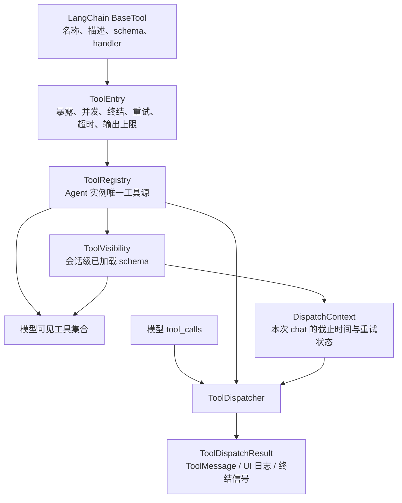

# tooling：工具注册、治理、分发与延迟加载

本目录是 Chat Mode 的工具治理层。它不重新实现 LangChain Tool，也不要求放弃
`@tool`/`BaseTool`：LangChain 继续负责工具名称、描述、参数 schema 和 handler；本目录在
`BaseTool` 外增加 Agent Harness 所需的注册策略、运行时校验、统一分发、安全并发、终结与重试语义、
输出限制，以及会话级延迟加载。

工具的运行时清单只有一个来源：每个 Agent 实例持有的 `ToolRegistry`。模型绑定、Dispatcher 查找、
延迟工具目录、schema 指纹和 Skill 权限裁剪都从该 Registry 派生，不再维护平行的工具名称常量或工具数组。

## 设计目标

- **保留 LangChain 生态**：`BaseTool` 仍是 schema 和 callable 的标准载体。
- **单一注册源**：工具定义与治理策略汇合为一个 `ToolEntry`，统一进入实例级 Registry。
- **默认保守**：工具默认立即可见、串行执行、非终结、无重试；只有显式声明后才开放额外能力。
- **不信任模型输出**：工具调用必须经过形状归一化、可见性检查和 Pydantic 运行时校验。
- **状态按会话隔离**：重试计数和延迟工具加载状态不写入共享 Agent 或全局变量。
- **失败可观察、可收敛**：预期失败转换成稳定错误协议；终结、重试耗尽和降级由策略驱动。
- **控制上下文成本**：低频工具启动时只展示名称与用途，需要时再加载完整 schema。

## 模块职责

| 模块 | 职责 |
|---|---|
| `models.py` | 工具调用、治理策略、富结果和统一分发结果的数据模型 |
| `registry.py` | 实例级工具注册、启动期不变量检查，以及各种只读投影视图 |
| `dispatcher.py` | 调用归一化、权限检查、参数验证、执行、超时、并发、重试和结果编码 |
| `visibility.py` | 单个聊天会话的延迟工具目录、搜索、schema 缓存与可见名称集合 |
| `discovery.py` | 模型可调用的 `tool_search`，以及延迟加载能力的安装函数 |
| `__init__.py` | 对外公共 API |

## 总体关系



这里有三个不同生命周期，不能混用：

1. `ToolRegistry` 属于 Agent 实例，描述“这个 Agent 拥有哪些工具和策略”。
2. `ToolVisibility` 属于聊天会话，描述“这个会话已经加载过哪些延迟工具 schema”。
3. `DispatchContext` 属于一次 `chat()` 调用，保存本次调用的墙钟截止时间、重试计数和本轮可见性快照。

## 核心数据模型

### ToolEntry

`ToolEntry` 把一个 LangChain `BaseTool` 与 Harness 策略绑定。主要字段如下：

| 字段 | 默认值 | 含义 |
|---|---:|---|
| `tool` | 必填 | LangChain `BaseTool`，提供名称、描述、参数 schema 与 handler |
| `exposure` | `IMMEDIATE` | `IMMEDIATE` 立即暴露完整 schema；`DEFERRED` 先进入紧凑目录 |
| `concurrency` | `SERIAL` | `SERIAL` 保守串行；`CONCURRENT_SAFE` 声明可与同批只读工具安全并发 |
| `terminal_on_success` | `False` | 成功后是否终结当前 Agent 循环 |
| `retry_limit` | `0` | 工具返回可重试失败后，允许模型修复并重试的次数 |
| `timeout_seconds` | `None` | 单个工具的墙钟超时上限 |
| `max_output_chars` | `20_000` | 返回给模型的最大字符数 |
| `audit_tag` | `""` | 写入分发日志的稳定分类标签 |
| `directory_description` | `""` | 延迟目录中的一句话用途；延迟工具必填 |
| `on_retry_exhausted` | `None` | 重试预算耗尽后的可选降级函数 |

`ToolEntry` 是冻结 dataclass，但其内部 `BaseTool` 不一定不可变。因此 Registry 应在 Agent 启动期完成装配，
服务期间只读使用，不应一边处理请求一边修改或替换工具对象。

### ToolCall

`ToolCall` 是 provider 无关的调用形状：

```text
call_id: 非空字符串
name:    非空字符串
arguments: 对象/Mapping
```

`ToolCall.from_langchain()` 会复制并冻结参数映射，防止上游字典在分发过程中被修改。模型给出的缺失 id、
空名称、非对象参数等输入会变成 `invalid_call`，不会进入 handler。

### ToolOutcome

普通工具可以直接返回 `str`、`dict` 或 Pydantic Model。需要表达业务失败、重试或终结覆盖时，返回
`ToolOutcome`：

```python
ToolOutcome(
    content="给模型看的结果",
    ok=False,
    error_code="advice_validation_failed",
    retryable=True,
    terminal_override=None,
    details={"errors": [...]},
)
```

`details` 用于重试降级等结构化状态，并可被上层按需消费；业务失败时它也可能进入返回给模型的错误对象，
因此不能放置凭据、原始异常、内部路径或其他敏感信息。错误内容仍会经过 Dispatcher 的统一编码和输出上限处理。

### ToolDispatchResult

Dispatcher 总是返回 `ToolDispatchResult`。它记录调用、内容、成功状态、错误码、是否终结、是否仍可重试、
耗时、截断状态、审计标签和结构化详情，并提供：

- `to_tool_message()`：生成与原始 `call_id` 一一对应的 LangChain `ToolMessage`；
- `to_log_record()`：生成供 Agent、CLI/Web 事件和审计消费的稳定字典。

### DispatchContext

一次 `ChatAgent.chat()` 创建一个 `DispatchContext`，其中：

- `retry_counts`：本次 chat 独享的失败计数，不会污染其他请求；
- `visible_tool_names`：当前模型轮次开始时冻结的可执行名称集合；
- `deadline`：基于 `time.monotonic()` 的整个 Agent 调用绝对截止时间；
- `progress_callback`：长工具运行期间的安全进度回调；
- `visibility`：本会话的 `ToolVisibility`，通过 LangChain `RunnableConfig` 传给 `tool_search`。
- `observer`、`round_id`、`round_index`：结构化生命周期通知及所属的真实模型轮次。

### 实时观察与可信终稿

Dispatcher 为每项调用分配独立 `tool_execution_id`，参数和可见性校验通过后发送
`tool.started`，实际完成时发送 `tool.completed`。并发工具各自完成即通知观察者，
`dispatch_many()` 的返回顺序仍与模型调用顺序一致。未执行的错误或跳过调用不发送开始事件，
公开耗时为 `null`。顾问展示层负责中文名称和确定性摘要，通用 Dispatcher 不生成领域文案。

`ToolOutcome.final_result` 和 `ToolDispatchResult.final_result` 可传递类型化 `AssistantResult`。
通过业务校验的完整队伍保存在该内部字段中，不受给模型的工具字符串截断影响；持久化层另存
结果快照，并在公开终稿中返回引用。普通工具字符串或最终回答中的 JSON 不会自动获得可信结果身份。

## 注册表：唯一工具来源

`ToolRegistry` 保存按注册顺序排列的 `ToolEntry`，并提供以下投影：

- `get(name)`：Dispatcher 和权限裁剪使用的精确查找；
- `names()` / `entries()`：稳定快照；
- `immediate_entries()` / `deferred_entries()`：按暴露策略分组；
- `model_tools(visible_names)`：生成绑定给模型的 `BaseTool` 列表；
- `model_schema_records(visible_names)`：生成 provider 无关的防御性 schema 副本；
- `deferred_directory()`：只包含延迟工具名称和一句话用途，不泄露完整 schema；
- `schema_digest(visible_names)`：与注册顺序无关、对契约变化敏感的 SHA-256 指纹，供 LLM 绑定缓存使用。

注意：`model_tools()` 不传 `visible_names` 时会投影全部注册工具，包括延迟工具。这适合测试和完整检查；
生产 Agent 每轮会显式传入 `ToolVisibility.visible_names()`，不能用无参数调用绕过延迟加载。

### 启动期不变量

`register()` 会立即拒绝以下配置：

- 注册对象不是 `ToolEntry`，或 `tool` 不是 `BaseTool`；
- 工具名称为空或重复；
- `exposure` / `concurrency` 不是规定枚举；
- `retry_limit < 0`、`timeout_seconds <= 0` 或 `max_output_chars <= 0`；
- 降级回调不可调用、或者配置回调却没有重试预算；
- `CONCURRENT_SAFE` 工具同时承担终结、重试或重试耗尽回调；
- 终结工具被配置成延迟工具；
- 延迟工具没有 `directory_description`；
- 工具无法生成顶层类型为 `object` 的输入 schema。

这些错误属于配置错误，应在 Agent 构造时暴露，而不是等用户请求进入循环后才失败。

## 标准注册方式

下面展示一个立即查询工具、一个延迟查询工具和一个终结工具。生产工具应使用严格 Pydantic schema：

```python
from langchain_core.tools import tool
from pydantic import BaseModel, ConfigDict, Field

from roco_pvp_agent.tooling import (
    ToolConcurrency,
    ToolEntry,
    ToolExposure,
    ToolRegistry,
    enable_deferred_loading,
)


class NameArgs(BaseModel):
    model_config = ConfigDict(extra="forbid", strict=True)

    name: str = Field(min_length=1)


class AnswerArgs(BaseModel):
    model_config = ConfigDict(extra="forbid", strict=True)

    text: str


@tool(args_schema=NameArgs)
def get_profile(name: str) -> dict:
    """查询常用档案。"""
    return {"name": name}


@tool(args_schema=NameArgs)
def analyze_matchup(name: str) -> dict:
    """执行低频对局分析。"""
    return {"target": name, "result": "..."}


@tool(args_schema=AnswerArgs)
def final_answer(text: str) -> str:
    """提交最终答案。"""
    return text


def build_registry() -> ToolRegistry:
    registry = ToolRegistry()
    registry.register(ToolEntry(
        tool=get_profile,
        concurrency=ToolConcurrency.CONCURRENT_SAFE,
        audit_tag="catalog",
    ))
    registry.register(ToolEntry(
        tool=analyze_matchup,
        exposure=ToolExposure.DEFERRED,
        concurrency=ToolConcurrency.CONCURRENT_SAFE,
        directory_description="分析指定精灵的对局表现。",
        timeout_seconds=10.0,
        audit_tag="analysis",
    ))
    registry.register(ToolEntry(
        tool=final_answer,
        terminal_on_success=True,
        audit_tag="terminal",
    ))

    # 所有延迟工具注册完成后调用一次；存在延迟工具时会注册即时可见的 tool_search。
    enable_deferred_loading(registry)
    return registry
```

项目中的实际装配入口是：

- 基础 Chat Agent：`../tools.py` 的 `build_agent_registry()`；
- 组队顾问：`../advisor/agent.py` 的 `_build_advisor_registry()`。

不要再额外维护 `ALL_TOOLS`、`ADVISOR_TOOLS`、终结工具名集合或手写的 LangChain 工具数组。
需要列表、schema 或名称时，从当前 Registry 投影。Skill JSON 中的 `allowed_tools` 例外：它表达单个
Skill 请求的最小权限，运行时仍必须与当前 Registry 求交，不能作为全局注册源。

## 单次工具调用的分发流程

`ToolDispatcher.dispatch()` 对一条模型调用依次执行：

1. 将 LangChain tool-call 字典归一化为不可变 `ToolCall`；
2. 按名称查询当前 Agent 的 `ToolRegistry`；
3. 检查该名称是否包含在本轮 `visible_tool_names`；
4. 计算工具自身超时与整个 Agent 剩余预算的较小值；
5. 当 `BaseTool` 暴露 Pydantic Model 时，使用同一模型显式校验参数；
6. 通过 LangChain `BaseTool.invoke()` 执行原始 handler；
7. 将普通返回值或 `ToolOutcome` 归一化；
8. 应用终结、重试、降级和输出截断策略；
9. 返回 `ToolDispatchResult`，由 Agent 转成 `ToolMessage` 和 UI/审计日志。

Dispatcher 会对 Pydantic schema 显式执行第 5 步，而不只依赖 LangChain 内部校验。原因是部分零参数
StructuredTool 可能静默丢弃额外字段；显式验证保证模型看到的 schema 与 handler 前的真实安全边界一致。
自定义 `BaseTool` 如果只返回原始 JSON Schema 字典，仍需由该 Tool 自己在 `invoke()` 中保证运行时验证；
生产工具应优先使用严格 Pydantic Model。

## 稳定错误协议

预期错误不会以未处理异常冒泡到 Agent Loop，而是编码为：

```json
{
  "ok": false,
  "error": {
    "code": "invalid_arguments",
    "message": "name: Field required"
  }
}
```

内置错误码如下：

| 错误码 | 场景 |
|---|---|
| `invalid_call` | 调用不是对象，或 id、名称、args 的形状非法 |
| `unknown_tool` | 名称不在 Registry 中 |
| `not_loaded` | 工具存在，但本会话/本轮尚未加载 |
| `invalid_arguments` | Pydantic 参数校验失败 |
| `execution_error` | handler 或降级回调执行异常 |
| `timeout` | 工具超时或整个 Agent 预算耗尽 |
| `output_too_large` | 预留的稳定分类；当前超长成功输出采用截断并设置 `truncated=True` |
| `skipped_after_terminal` | 同批前序终结工具成功，后续调用为补全协议而不再执行 |

handler 的原始异常消息可能含路径、凭据或服务端响应，因此不会返回给模型。Dispatcher 只返回受控文案，
并在 `details` 中保留异常类型。参数校验错误也会排除原始输入值，降低敏感数据回显风险。

## 终结、重试与降级

- 普通工具成功不会终结循环。
- `terminal_on_success=True` 的工具仅在成功时终结。
- 业务校验失败可返回 `ToolOutcome(ok=False, retryable=True)`。
- `retry_limit=1` 表示第一次失败允许模型修复一次，第二次失败进入“重试耗尽”。
- 重试计数位于本次 `DispatchContext`，同一共享 Agent 的不同请求互不污染。
- `on_retry_exhausted` 可把最后一次失败转换成安全降级结果，并用 `terminal_override=True` 强制收敛。
- 串行批次中一旦出现终结结果，后续调用不会执行，但每个原始 `call_id` 仍会收到
  `skipped_after_terminal` ToolMessage，保证历史可重放。

终结策略属于 Registry 元数据。Agent Loop 和 Dispatcher 不应通过 `if tool_name == ...` 判断具体业务工具。

## 安全并发

`dispatch_many()` 只有在以下条件全部满足时才并发：

- 同批至少两个调用；
- 每个调用都能被合法归一化；
- 每个名称都已注册；
- 每个条目都显式标记为 `CONCURRENT_SAFE`；
- 没有终结工具。

只要混入一个未知、畸形、串行或终结调用，整个批次就按模型顺序串行执行。这样可以保留写后读、重试和
终结跳过语义。并发路径使用有上限的线程池，默认最多 4 个 worker；实际 worker 数取批次数与上限的较小值。
即使完成顺序不同，返回结果仍严格按照模型调用顺序排列。

只有确定满足以下条件的工具才应标记 `CONCURRENT_SAFE`：

- 只读或无共享可变状态；
- 不依赖同批其他工具的结果；
- 不承担终结或重试状态；
- handler 本身及其依赖允许多线程调用。

“看起来像查询”不足以证明并发安全；不确定时保持默认 `SERIAL`。

## 超时与墙钟预算

有效工具超时是下面两者的最小值：

```text
min(ToolEntry.timeout_seconds, DispatchContext.deadline - now)
```

未配置的项不参与计算。预算在 handler 启动前已经耗尽时，Dispatcher 直接返回 `timeout`，不会启动 handler。
运行中的长工具每约 5 秒可通过 `progress_callback` 发出一次安全进度提示。

需要特别注意：Python 线程无法安全强杀正在执行的 handler。超时实现使用 daemon worker，让 Dispatcher 和
Agent 能按时返回；已经启动的 handler 仍可能在后台完成。因此：

- 超时不是事务回滚；
- 有外部副作用的工具应自行支持取消、幂等键或事务；
- 不要在超时后盲目重试非幂等写操作；
- 返回给模型的结果不会包含超时后才产生的“迟到结果”。

## 延迟加载

延迟加载只控制**已经注册且经过治理的本地工具**。它不会动态 import 任意代码，也不会从网络安装或执行
模型指定的工具。

### 注册阶段

1. 低频工具以 `exposure=DEFERRED` 注册，并提供非空 `directory_description`。
2. 所有工具装配完成后调用一次 `enable_deferred_loading(registry)`。
3. 如果存在延迟工具，该函数注册唯一的即时工具 `tool_search`；没有延迟工具时不做任何事。

不要对同一 Registry 重复调用 `enable_deferred_loading()`，否则会因 `tool_search` 重名触发注册错误。

### 会话阶段

会话开始时：

- 立即工具和 `tool_search` 的完整 schema 对模型可见；
- 延迟工具只通过 system prompt 中的紧凑目录展示名称与一句话用途；
- 延迟工具不能直接执行，猜中名称也会得到 `not_loaded`。

模型可使用两种搜索方式，且必须二选一：

```json
{"tool_names": ["simulate_matchups"]}
```

```json
{"queries": ["模拟对局", "胜率"], "top_k": 3}
```

精确名称加载只接受延迟工具；立即工具、未知名称都会进入 `missing`。关键词搜索对工具名称、名称 token 和
目录描述进行确定性评分，按“分数降序、名称升序”返回，默认 Top 3，通过模型调用时最多 Top 5。
重复命中使用会话缓存，并通过 `load_state=loaded|cached` 呈现。

### 为什么必须下一轮调用

每个模型轮次开始时，Agent 同时取得：

```python
visible_names = visibility.visible_names()
dispatch_context.visible_tool_names = set(visible_names)
```

`tool_search` 可以更新会话级缓存，但不会修改本轮已经冻结的 Dispatcher 可见性快照。因此模型在同一回复中
同时调用 `tool_search` 和刚发现的工具时，后者仍会得到 `not_loaded`。下一模型轮次会重新派生可见集合、
绑定新增 schema，此时才能执行。这条规则防止模型在看到参数契约之前猜测调用。

### 会话隔离

`ToolVisibility` 内部只缓存由同一 Registry 生成的防御性 schema 副本，并用锁保护加载状态。两个会话即使
共享同一个 Agent/Registry，也拥有不同的 `ToolVisibility`，一个会话加载的工具不会泄漏到另一个会话。

- CLI REPL 在会话循环外创建一次 Visibility，并在多轮输入间复用；
- 旧 Web `ChatContext` 把 Visibility 与历史一起保存在内存 session state；新任务协议在完整 Turn 的 checkpoint 中保存已加载名称，恢复时从当前 Registry 重新加载；
- reset 或会话逐出会同时清除历史和延迟工具缓存；
- 直接调用 `agent.chat()` 且不传 Visibility 时，每次调用会创建新的加载状态。

## 与 ChatAgent 的集成

`ChatAgent` 接收已经装配好的 `registry`，并据此创建 `ToolDispatcher`。在线循环每轮执行：

1. 从会话 Visibility 得到本轮 `visible_names` 和尚未加载的目录提示；
2. 使用 `registry.model_tools(visible_names)` 绑定模型；
3. 使用 `registry.schema_digest(visible_names)` 区分 LLM 工具绑定缓存；
4. 调用模型并取得 `tool_calls`；
5. 把整批调用交给 `dispatcher.dispatch_many()`；
6. 按原调用顺序追加 `ToolMessage` 并发送安全工具事件；
7. 命中终结结果则返回，否则进入下一模型轮次；
8. 超时、模型异常或轮次耗尽时走 Agent 的有界降级路径。

Agent Loop 只消费 `ToolDispatchResult`，不识别具体工具名称。这使新增工具的正常路径只涉及“定义 schema 与
handler + 注册 ToolEntry”，无需修改循环分支。

`ChatAgent(tools=[...])` 仍保留给测试和旧调用方的注入缝，进入循环前会由 `build_agent_registry()` 归一化。
生产代码应优先显式传入 Registry，以免丢失暴露、并发、超时、重试和审计策略。

## 安全边界与非目标

本目录负责工具调用协议安全，但不是完整的业务授权系统：

- `ToolVisibility` 是 schema 暴露和本轮执行闸，不替代用户身份、租户或角色授权；
- Dispatcher 不判断用户问题是否属于洛克王国领域，领域边界由顾问的 ScopeGate 在进入 LLM 前处理；
- Dispatcher 不验证业务数据真假，阵容合法性、版本和证据约束由对应业务 Gate/handler 负责；
- `audit_tag` 只是稳定分类标签，真正的审计持久化由上层消费 `to_log_record()`；
- 输出截断按 Python 字符数计算，不是模型 token 数；
- 超长 JSON 成功结果被字符截断后不保证仍是合法 JSON；结构化工具应设置合理上限或在 handler 内先分页/摘要；
- 延迟加载降低 schema 上下文成本，不减少 Registry 中已经存在的 handler 权限，实际执行仍依赖本轮可见性闸。

已经实现的协议防护包括：

- 严格 schema 与额外字段拒绝；
- 未注册/未加载工具拒绝；
- handler 异常脱敏；
- 工具输出上限；
- Agent 总预算与工具级超时；
- 保守批次并发；
- 会话状态隔离；
- 防御性 schema 副本和不可变调用参数；
- 终结后的调用补全，保证跨 provider 历史可重放。

## 新增工具检查清单

1. 为参数建立独立 Pydantic Model，并使用 `ConfigDict(extra="forbid", strict=True)`。
2. 使用 LangChain `@tool(args_schema=...)` 定义清晰、窄职责的 handler。
3. 确认 handler 不接收模型不应控制的路径、SQL、模块名或任意代码。
4. 在对应 Agent 的 Registry 装配函数中注册一个 `ToolEntry`。
5. 根据使用频率选择 `IMMEDIATE` 或 `DEFERRED`；延迟工具填写目录说明。
6. 只有经过线程安全审查的无依赖只读工具才声明 `CONCURRENT_SAFE`。
7. 明确是否终结、是否可重试，以及重试耗尽后的降级结果。
8. 根据成本和敏感性设置 `timeout_seconds`、`max_output_chars` 和 `audit_tag`。
9. 不新增第二份全局工具名清单；Skill 权限只声明最小集合，并与 Registry 求交。
10. 添加 Registry、Dispatcher、schema、并发或延迟加载测试，并运行全量回归。

## 测试

核心测试位于：

- `../../../tests/test_tool_registry.py`
- `../../../tests/test_tool_dispatcher.py`
- `../../../tests/test_tool_deferred_loading.py`
- `../../../tests/test_advisor_tool_schemas.py`
- `../../../tests/test_agent.py`

运行工具层定向测试：

```bash
uv run pytest -q \
  tests/test_tool_registry.py \
  tests/test_tool_dispatcher.py \
  tests/test_tool_deferred_loading.py \
  tests/test_advisor_tool_schemas.py
```

交付前运行：

```bash
uv run pytest -q
git diff --check
```
