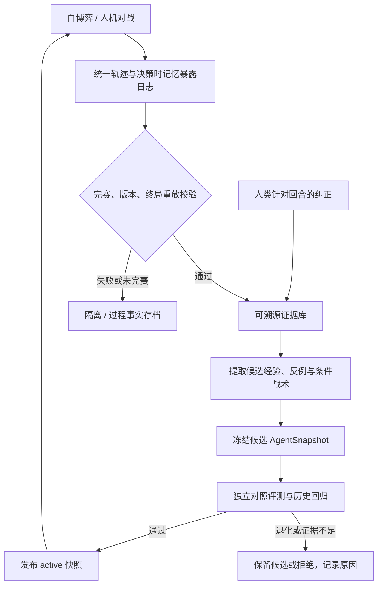

# 将现有记忆改造成可信的 PVP 学习闭环

本方案对应 [审查报告](./memory-audit.zh-CN.md) 的 F1～F11。以下接口、目录与字段为建议设计，**尚未实现**。目标是保留现有引擎、LLMPlayer、Playbook、MemoryStore/GlobalMemStore 和评测池的有用部分，分步改造，而不是一次重写所有模块。

## 1. 用什么定义“变强”

不能以 Agent 战胜正在同步更新的自己、Q 平均值上升或记忆增长量作为主要指标。双方同时学习时总胜率仍围绕对称结果波动；更长或更多的文本也可能让决策更差。

主指标应为：**冻结的新 Agent 在未用于学习的阵容、种子与固定对手池上，相对上一代冻结 Agent 的配对对战得分增益**。胜、和、负分别记 1、0.5、0，同时独立报告胜率/和局率/败率；未完成或无效对局单列，不冒充和局。该分数定义需要贯穿 Q、收益矩阵与评测，不宜再把“1－胜率”直接视为对手胜率。

辅助指标包括：各对手/战术类别的最差表现、残局转化率、非法动作与随机兜底率、预测校准、每局/每回合 token 与延迟、经验命中覆盖率。指标改善仍须结合对手强度，不能只用更多随机对手局数证明水平提高。

阶段性成功标准是：先证明某个稳定版本的记忆在预先划定的目标分布上带来可重复的净收益，再追求多轮迭代持续提高。对局结果应区分“流程通过”“未发现退化”“有统计证据的提升”，不要统一写成“进化成功”。

## 2. 统一从对局到发布的流程



训练可持续产出候选，但同一对局始终读取同一个快照。人机页面结束对局后只负责可靠落盘和投递学习任务，复盘与评测在后续任务中执行，避免让界面请求等待几十场对照战斗。

建议增加统一服务边界（名字仅供实现时参考）：

```text
normalize_episode(raw_record) -> EpisodeRecord
validate_and_replay(episode) -> ValidatedEpisode | QuarantineReason
enqueue_learning(validated_episode_id) -> idempotent_job_id
extract_evidence(validated_episode) -> Evidence[]
credit_exposures(episode_id, snapshot_id) -> CreditEvents[]
propose_memory(evidence_ids) -> CandidateMemoryRevision[]
evaluate_snapshot(candidate, champion, eval_manifest) -> EvaluationReport
promote_snapshot(report_id) -> ActiveSnapshotPointer
```

## 3. 数据契约：先解决“学了什么、依据是什么”

### 3.1 EpisodeRecord 与环境指纹

| 组 | 建议字段 | 用途 |
|---|---|---|
| 身份与来源 | schema_version、episode_id、source=selfplay/human、started_at、ended_at | 去重、人机分层、时间追踪 |
| 完成情况 | status、termination_reason、winner、score_by_side | 区分完赛、和局、放弃、超时与数据无效 |
| 环境 | data_source、data_digest、actual_rules_hash、engine_behavior_version、observation_schema、action_schema | 数据/实际赛制/执行规则隔离 |
| 参与者 | agent_side、player_kind、model_config_hash、policy_snapshot_id、opponent_snapshot_id | 冻结双方策略身份；不得保存 API key |
| 重放材料 | seed、规范化 roster、原始 TeamPick（可选）、items、starters、完整 Decision、state_hash | 消除 UI 与 selfplay 格式差异 |
| 结果校验 | replay_ok、replayed_terminal_status、replayed_winner、validation_errors | 不直接信任外层 winner 字段 |

终局回报只来自重放确认的结果。未完赛可以提供“某个公开技能造成某种效果”的过程事实，但不得伪造整局好坏标签。旧记录缺失字段保持 unknown；迁移时追加 provenance，不用当前配置覆盖未知历史。

### 3.2 DecisionTrace：实际暴露日志

每次主动作、首发、补位都记录：

```text
episode_id, side, turn, decision_phase
observation_hash, observation_schema, legal_actions_hash
memory_snapshot_id
retrieved: [{entry_id, revision, score, match_features}]
injected: [{entry_id, revision, content_hash}]
decision: {action_semantics, engine_action, item, item_arg}
prediction, decision_source=llm/fallback/human/offline_test
usage, latency, retry_count
```

日志描述可观察行为，不要求保存模型隐藏思维链。`retrieved` 与 `injected` 分开，因为召回后可能被合法性、冲突或预算过滤。仅检索未注入不计曝光；LLM fallback 单独统计，不能把其动作匹配当作策略采纳。

为兼顾旧实现，先扩展 `LLMPlayer._record_turn` 和 UI serializer，GlobalMem 已有加载 ID 可以保留。未知旧轨迹不回填虚构的使用记录。

### 3.3 三类长期记忆，职责分开

| 层次 | 保存什么 | 从现状如何演进 |
|---|---|---|
| 对局证据 | 可见状态、真实动作、公开结果、终局反馈、关键回合、支持/反例 | 将当前局部 MemoryEntry 关联到不可变 episode/turn evidence |
| 条件战术 | trigger、建议动作/小步骤、适用边界、反例、验证结果 | 将高价值重复经验凝练进 GlobalMem/Playbook，不只是压缩战报 |
| 环境知识与对手信念 | 引擎验证的机制；对手风格/未知配招的概率假设 | 与行动建议分开；公开机制事实与推测必须有不同可信度 |

已有图鉴和引擎是机制事实的优先来源。不要让 LLM 从少数胜败自行“记住”与引擎矛盾的规则。对手信念是特定观察/对手类型下的分布，不能从旧对局获知某技能就当成新对局已揭示事实。

每条战术候选至少包含：

```text
memory_id, revision, status
trigger_features, preconditions, contraindications
recommendation, semantic_actions, verification_checks
support_episode_ids, evidence_refs, counter_evidence_refs
source_kind, environment_fingerprint
exposure_stats, outcome_stats, validation_report_ids
supersedes, created_at, reviewed_at
```

事实证据按独立 episode 去重；不同对局相同动作需要追加支持或反例，不能因为粗 ID 一样直接丢弃。摘要是派生视图，原始证据链接一直保留。

## 4. 归因、检索与晋升

### 4.1 先诚实统计，再改进贡献估计

第一版只计算三件事：实际曝光次数、曝光后的语义动作一致次数、曝光所在对局的得分及不确定性。现有 Q 可改名为 `outcome_association` 并保留作迁移字段；它表示相关性，不表示“该条经验导致赢”。

终局反馈按 `(episode_id, side, memory_id, revision)` 只更新一次；逐回合曝光计数仍可累计，但不要让长局多次重复曝光放大同一场胜利。信用事件用唯一键，重放任务不二次领奖。胜/和/负的口径统一，未完赛不给终局奖励。

第二版再增加辅助信号：

- 关键回合的公开资源/血线/命数变化和预测误差，注明其为局部代理指标。
- 同一局面同一随机种子比较候选动作；后续执行采用冻结的部署策略或已验证风格混合，记录 continuation policy。
- 迷雾场景以当时可见信息约束对手隐藏配置采样；全状态 oracle 结果只在离线保留，不能直接生成“玩家当时应知道”的策略条件。
- 人类纠正保存为偏好或假设，带 episode、turn、提出时间和理由；通过引擎或独立样本验证后再提高置信度。

不同信号分字段保存，暂不混成单个不可解释的分数。之后若用混合回报，权重必须在选择集上消融检验，不能照抄其他任务的论文超参数。

### 4.2 检索以战术适用性为先

先过滤环境版本、动作协议、赛制与策略边界，再做相似度召回和效用排序。建议特征包括：

| 类别 | 可用信息 |
|---|---|
| 胜利条件 | 双方剩余命数、可见存活单位、残局资源与关键保留位 |
| 当前威胁 | 我方血量、对手公开血线区间、属性关系、已知速度关系/未知标记 |
| 资源与约束 | 精确可见能量、技能可用性、冷却、道具、合法行动集合 |
| 持续效果 | 已公开状态、增减益、印记、天气、场地及已知持续时间 |
| 信息状态 | 具体已揭示技能集合、对手已观察行为、未揭示信息的概率假设 |
| 策略身份 | 当前构筑的关键技能/角色、对手策略簇、适用规则 |

推荐动作使用稳定技能/单位/道具 ID 及当前合法映射；不使用跨局不稳定的槽位作为策略身份。视角统一为 self/opponent，使有依据的知识可以跨 a/b 席位复用，但须转换全部方向性信息，不能简单删除 side 字段。

保留快速结构化检索；文本 embedding 在积累了标注检索集后再评估。召回评测以“是否找到可用经验、是否错误注入禁忌经验”为指标，不以向量相似度高低作质量证明。大量同分候选应有可复现的多样性/新鲜度排序，并在最终排序前避免固定前 10 条垄断。

### 4.3 战术生命周期与发布

建议状态为 `candidate → probationary → active → retired/quarantined`。状态是可审计属性，不能用“有没有 superseded_by”代替所有治理。

1. 单局复盘默认生成 candidate，不能立即淘汰 active。
2. 校验格式、证据 ID、当前可见信息、语义动作、适用条件和反例。
3. 初始可要求至少 3 个独立训练 episode 支持后进入试用；这是待调的工程起点，不是有效性保证。确定性引擎可验证的机制事实可走单独验证通路。
4. 通过冻结 AgentSnapshot 的评测后才发布。稀有残局可保留 candidate 等待证据，不靠放宽统计要求强行晋升。
5. 发现反例时收紧边界或形成新修订，保留旧证据；大改文本必须重新验证。
6. 相同文本 update 合并证据并保持活跃版本；禁止自指和替代环。回滚只移动 active snapshot 指针，不覆写历史内容。

每局读取冻结快照，后续新学习只进入 candidate store，下一次已验证发布才影响实战。这也使候选失败时可以恢复完整 Agent，而非只恢复手册但留下坏 Q/坏记忆。

## 5. 证明记忆确实提高实力的实验

### 5.1 训练、选择、最终测试分离

- **D_train：**自博弈、训练人机对局、反思、反事实与经验构建；覆盖多个阵容/技能配置、资源阶段和对手风格。
- **D_select：**候选快照选择与超参数调整。可反复使用，但不能宣传为最终泛化结果。
- **D_test：**开发阶段不用于反思、检索入库、Q 更新、手册编辑或候选选择。按预定里程碑评估并发布结果；如果持续据报告改策略，应轮换新的最终留出集。

按整场对局及阵容/家族/对手策略分组划分，不能把同局不同回合拆到训练和测试。种子不同只能增加随机样本，不能代替阵容与策略留出。人机训练集和人机评测集也分开。

### 5.2 最小消融矩阵

| 实验组 | 固定内容 | 变量 |
|---|---|---|
| A：无记忆 | 同模型、基础提示、Playbook、推理预算 | 关闭 local/global |
| B：局部 | 同上 | 只开冻结 local |
| C：全局 | 同上 | 只开冻结 GlobalMem |
| D：组合 | 同上 | 同时开 local/global |
| E：上一代 | 记录并冻结上一代完整配置 | 上一代快照 |

A～D 用于识别记忆与联合干扰；D/E 用于完整版本的发布判断。如果新旧 Playbook 也不同，D/E 测的是整体提升，不能把全部提升归因于记忆。进阶可加随机无关记忆作为噪声对照，但先完成上述四组。

对手池包含 random（仅底线）、启发式/极端风格、历史真实 Agent 快照、保留的针对性策略，以及预算允许时的独立模型或留出人类对手。双方镜像自博弈可以生成数据，但单独不能证明实力提高。所谓“可利用性”应标为当前挑战者池下的估计，不能冒称最优对手下的严格 exploitability。

每个区组固定阵容、引擎种子、先后/席位安排和对手快照，各实验组在相同区组运行；正式评测覆盖双方席位。`temperature=0` 也不保证远端模型严格确定，因此保留重复次数、模型版本与原始动作日志。

### 5.3 统计与发布规则

主要报告配对区组上的得分差 `Δscore`，用按阵容/对手组聚类的配对 bootstrap 或合适的配对检验估计置信区间；不要用两个独立 Wilson 区间相减冒充配对差区间。同一局多回合、多条记忆、多次检索不能膨胀成独立对局样本。

发布前预注册最小有用提升 δ、可接受退化 ε、重要对手类别、最大评测预算与停止规则。例如可把 2 个百分点作为初始 δ 候选，但最终应由部署目标、成本与先导样本方差确定，不能靠几场胜利设门槛。若多候选反复试探同一选择集，需独立确认或采用控制反复查看偏差的规则。

建议发布要求：

1. 所有确定性完整性检查通过；没有未校验的环境/模型/记忆版本变化。
2. 对比上一代的主要增益满足预注册判据；关键对手分层的配对得分差置信区间下界不低于 `−ε`，或满足预注册的等效非劣判据。样本不足以判定时保持旧版，不能将“未发现退化”当成已证明非劣。
3. 随机兜底/非法动作/重放失败不增加到预设不可接受水平。
4. 成本与延迟在预算内；收益不能完全来自大幅增加推理预算却不披露。
5. 证据不足时保持上一代，记录“未确定”，不强行晋升，也不把未显著提升写成确认无效。

冻结 `evaluation_manifest`：实例完整内容及 seed、环境指纹、双方策略快照、模型/采样参数、动作与得分口径、评测代码版本、检索配置、记忆内容摘要。续跑时校验整个 manifest，不能只比较实例名称。

## 6. 分期实施与验收

### P0 阶段：先修数据和归因（最高实施顺序，对应报告 P1）

| 任务 | 主要文件 | 验收条件 |
|---|---|---|
| 统一轨迹初始化与重放 | `environment/replay.py`、`evolution/analysis.py`、`credit.py`、`advisor/trajectory.py` | 非 0 首发/入场/定向道具/补位一致；伪造 winner 或 done 被拒绝 |
| 严格终局与统计口径 | `advisor/trajectory.py`、`bench.py`、`league.py` | 未完赛不进终局分母；镜像按明示席位口径统计；胜和负一致 |
| 记录实际注入 | `battle/player.py`、`selfplay.py`、`ui/battle.py` | 已注入 ID/修订可重建；空库首局 adopted/credit 为 0；fallback 单独标记 |
| 按事件更新与幂等 | `memory_inject.py`、`globalmem_run.py` | 同 episode 重跑 Q 不二次更新；战后新条目不获得旧曝光奖励 |
| 修 GlobalMem 替代 | `globalmem.py`、`globalmem_analyst.py` | 相同文本活跃数不变；替代关系无环；失败候选不影响 active |
| 加强环境版本与配置 | `datafingerprint.py`、`config.py`、`run.py` | 实际规则/行为版本变化被识别；unknown 隔离；每个配置参数可验证生效 |

这一阶段只需少量确定性回归与现有诊断的修复版本，无需付费胜率实验。

### P1 阶段：接通人机学习与快照评测

| 任务 | 主要位置 | 验收条件 |
|---|---|---|
| 统一 EpisodeRecord | `selfplay.py`、`ui/battle.py`、新增轨迹 schema/adapter | 同一合法对局从两种入口进入统一分析；旧格式可迁移或明确隔离 |
| 战后学习任务 | `routes_battle.py`、新增学习队列/worker | 一局完成只生成一个学习任务；失败可重试且无重复奖励；任务状态可追踪 |
| AgentSnapshot | 新增快照模块，扩展 `pool.py/run.py` | 可冻结并恢复模型/手册/两库/检索配置；测试运行不写库 |
| 对战评测对齐 | `bench.py/run.py/globalmem_run.py` | A～D 四组走同一真实执行路径；历史快照按其策略语义执行 |
| 长跑状态修复 | `run.py/pool.py/valuefn.py` | 慢更新入池有完整分数；续跑 manifest 不同须重评；ValueFn 接口回归通过 |

初次真实 LLM 实验先用小预算估算方差与成本，再按效应目标确定正式样本量；小样本只作先导，不发布“已持续变强”的结论。

### P2 阶段：提高经验质量与泛化

加入语义动作、结构化战术特征、适用条件、反例、独立 episode 支持数及证据链；将已证实经验凝练为条件战术并进入 Playbook/GlobalMem。引入多样对手和覆盖驱动训练采样，补人类纠正、首发/补位与残局决策。

验收应同时包含检索标注集（易混局面与禁忌动作）、未见阵容/对手消融实验、候选退化自动回滚。保留败局中的正确动作与胜局中的错误动作，不能只收藏胜者经验。

### P3 阶段：规模化与长期学习

数据量和多写者需求出现后迁移事务存储（例如 SQLite WAL 单机起步）并增加索引、批量事件、压缩与归档。先定明确的读取与写入接口，避免为使用向量数据库而更换整个架构。

监测 active 覆盖率、反例率、候选接受率、按对手分层的保持能力、检索成本、提示 token 与失败原因。unknown 指标返回 null 和原因，不能固定填 0。构建历史能力保留集以测遗忘；“检索后没选同一个动作”不应直接等同遗忘。

## 7. 旧库如何处理

1. 保留当前原始 JSONL 和对局，先制作不可变迁移快照；本次审查不改它们。
2. 现有局部 Q 因使用归因不可靠，标记为 legacy outcome association；不能回填不存在的曝光日志，也不能拿旧 Q 直接作新系统晋升证据。
3. 对能恢复的原始对局统一重放并生成事实证据；不能恢复出处的文本只作为低置信候选，不能当已验证战术。
4. GlobalMem 保留文本、来源对局与替代链，检测自环/循环并隔离异常版本；新验证重新评估文本有效性。
5. 旧池缺完整评测 manifest 的分数可以展示为历史数据，但进入新门禁前必须重评。

## 8. 当前最值得做的最小版本

优先交付一个可验证的小闭环：**一场合法人机/自博弈对局 → 统一完赛轨迹 → 真实注入日志 → 幂等信用事件 → 候选经验 → 冻结组合策略对照评测 → 晋升或保留旧版。**

先让这一闭环在小库和少量战术上可信运行。确认独立对手上有收益后，再增加更复杂的检索、对手信念、技能抽象与大规模自博弈；这样每一步都有明确的能力依据。
